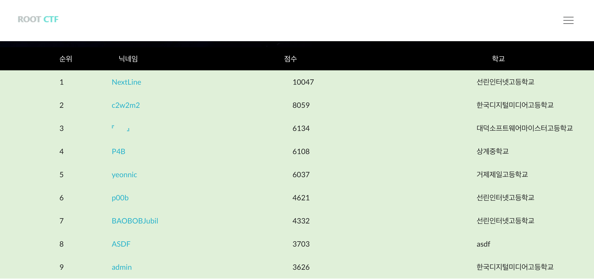

# ROOTCTF 2017 (Junior) WriteUp 


## Secure KeyManager 400 (Solver : 36)

### 1. Introduction

| RELRO         | STACK CANARY | NX         | PIE    | RPATH    | RUNPATH    | FILE             |
|---------------|--------------|------------|--------|----------|------------|------------------|
| Partial RELRO | Canary found | NX enabled | No PIE | No RPATH | No RUNPATH | Securekeymanager | 

x64 바이너리이다.

### 2. Vulnerability
```c
