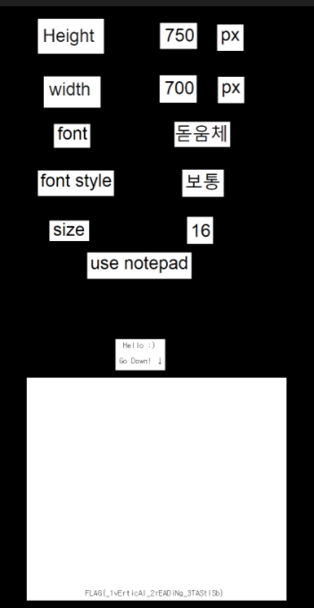
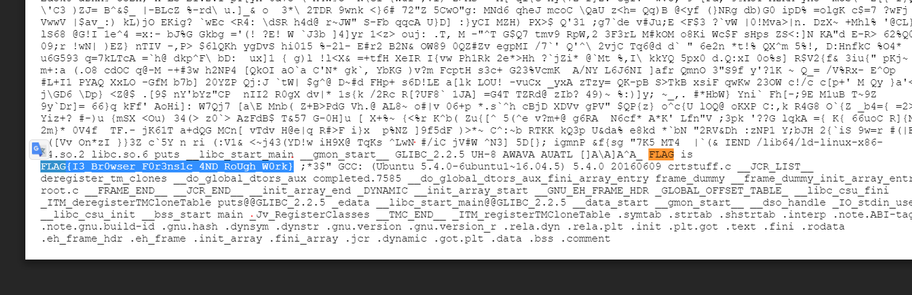
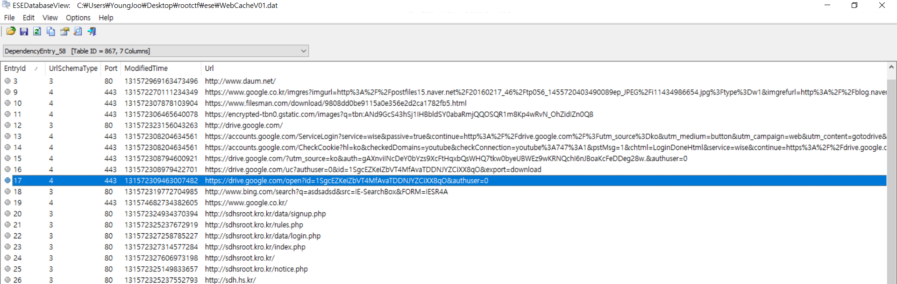
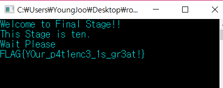

# ROOTCTF 2017 (Junior) WriteUp 


2017.12.22 09:00:00 ~ 2017.12.23.21:00:00 (총 36시간)

Solve : Misc - 5/5 / Pwn - 5/5 / Web - 4/5 / Reversing - 3/5

Rank : 1

NickName : NextLine

Name : 이영주 (선린인터넷고)

## Welcome 50 (Misc)
```
제 1회 서울디지텍고등학교 해킹방어대회 
에 오신 것을 환영합니다
모든 문제의 정답은 다음과 같은 형식을 가지고 있습니다 
정답 형식 = FLAG{내용} 

FLAG{Welcome_to_Seoul_Digitech_ROOT_CTF} 
```

FLAG : FLAG{Welcome_to_Seoul_Digitech_ROOT_CTF} 
<br><br><br>
## Calculate 167 (Misc)
```
누가 내 패스워드좀 알려줘!
hint : 역연산

Link
```

문제에서는 아래와 같은 python코드가 주어진다.
```python
def one(num, size):
    r = num + size
    r += 915
    return r


def two(num, size):
    r = num - size
    r -= 372
    return r


def three(num, size):
    r = num ^ size
    r ^= 826
    return r


def four(num, size):
    size %= 32
    r = num >> (32 - size)
    b = (num << size) - (r << 32)
    return b + r


if __name__ == "__main__":
    result = [5040, 4944, 5088, 4992, 7232, 4848, 7584, 7344, 4288, 7408, 7360, 7584, 4608, 4880, 4320, 7328, 7360,
              4608, 4896, 4320, 7472, 7328, 7360, 4608, 4752, 4368, 4848, 4608, 4848, 4368, 4944, 7200]
    string = raw_input("Input String : ")
    Number = []
    tmp = 0

    for i in string:
        Number.append(ord(i))

    for i in Number:
        Number[tmp] = one(i, 100)
        tmp += 1
    tmp = 0

    for i in Number:
        Number[tmp] = two(i, 100)
        tmp += 1
    tmp = 0

    for i in Number:
        Number[tmp] = three(i, 100)
        tmp += 1
    tmp = 0

    for i in Number:
        Number[tmp] = four(i, 100)
        tmp += 1

    print Number
    if Number == result:
        print "Correct!!"
    else:
        print "Incorrect.."
```

역연산 해주면 된다.
```python
def one(num, size):
    a = num - 915
    a -= size
    return a

def two(num, size):
    a = num + 372
    a += size
    return a

def three(num, size):
    a = num ^ 826
    a = a ^ size
    return a

def four(num, size):
    a = num / 16
    return a

if __name__ == "__main__":
    Number = [5040, 4944, 5088, 4992, 7232, 4848, 7584, 7344, 4288, 7408, 7360, 7584, 4608, 4880, 4320, 7328, 7360,
              4608, 4896, 4320, 7472, 7328, 7360, 4608, 4752, 4368, 4848, 4608, 4848, 4368, 4944, 7200]
    tmp = 0

    for i in Number:
        Number[tmp] = four(i, 100)
        tmp += 1
    tmp = 0

    for i in Number:
        Number[tmp] = three(i, 100)
        tmp += 1
    tmp = 0

    for i in Number:
        Number[tmp] = two(i, 100)
        tmp += 1
    tmp = 0

    for i in Number:
        Number[tmp] = one(i, 100)
        tmp += 1

flag = ''
for i in Number:
    flag += chr(i)

print flag
```

FLAG : FLAG{Rev3rse_P1us_M1nus_X0R_R0L}
<br><br><br>
## Vocabulary 460 (Misc)
```
플래그가 적힌 친구의 단어장을 잃어버렸다 
어서 빨리 찾아야 된다.
그 친구가 화내기 전에 플래그라도 찾아보자
hint : PNG height

Link
```

PNG 파일을 받아서 string을 확인해보면 아래와 같은 내용이 있다.
```
{VOcAbulAry}
_________________________________________________________
vAluE
		|vAry
ExpEriENcE
		|ENSurE
 ..
rEfErENcE
		|rEquESt
			|
thrOugh ...
	|vAry
iDENtify
	|ENSurE
 ..
cONcErN
	|rEquESt
			|
AblE
		|vAry
likEly ...
	|ENSurE
 ..
_________________________________________________________
rEMAiN
 ...
	|rEquESt
			|
ENcOurAgE
	|vAry
ApplE
		|ENSurE
 ..
DEtErMiNE
	|rEquESt
			|
iMplEMENt
	|vAry
NEcESSAry
	|ENSurE
 ..
gENErAl
	|rEquESt
			|
_________________________________________________________
ThiS lEttEr wAS firSt iNtrODucED iN ENglAND AND luckED
ArOuND thE wOrlD A yEAr, AND NOw thiS lEttEr tO yOu
ShOulD lEAvE yOu withiN fOur DAyS. YOu MuSt SEND SEvEN Of
thESE, iNcluDiNg thiS lEttEr, tO SOMEONE whO NEEDS gOOD
luck. COpyiNg iS AlSO rEcOMMENDED. It MAy bE
SupErStitiON, but it iS truE.IN ADDitiON, thE FLAG MAy
bE........bEE.......bEEEE.....{ tHANk_FiND_MY_vOCAbuLAry
}. MAybE NOt. Or iNcrEASE the hEight tO 1000px.
```
파일의 높이를 1000px 증가시키라고한다. 해주면 된다.



FLAG : FLAG{_1vErticAl_2rEADiNg_3TAStlSb}
<br><br><br>

## Do you know ㅁㅁㅁ? 706 (Misc)
```
어렵디 어려운 이 문제... 누가 풀 것인가?
복호화 사이트 -> ㅁㅁㅁencryption.com
hint1 : cat == 고양이
hint2 : md5encryption.com
hint3 : dog == 갯수

Link
```

플레그를 찾으라면서 아래와같은 파일을 준다.
```
Find the Flag!
[0 = 4dog] [2 = 1dog] [4 = 4dog] [5 = 4dog]
[6 = 1dog] [7 = 1dog] [8 = 2dog] [9 = 3dog]
[a = 4dog] [b = 3dog] [c = 3dog] [d = 2dog]


g d a 6 v z 1 3
d o 9 8 j 0 1 x
1 b i 9 8 1 2 6
b z 9 6 y u 3 1

k 6 9 7 j i h z
k y i j t b i n
y 9 5 g f j 7 b
3 n i u t g h m

a b c d e f g h
1 d 7 9 7 9 6 6
c b a w c g 9 9
c c a a c c d d

f 1 5 1 2 g 4 1
h 6 4 c b 1 0 8

...
...

```
0 = 4dog를 해석하면 0이 4개있다는거다. 그 조건에 맞는 문자열을 아래서 찾은다음 md5encryption.com 에서 decrypt하면 flag가 나온다.

FLAG : FLAG is FLAG{MD5_3nCryPt_Ye@h!}
<br><br><br>

## Find the flag 913 (Misc)
```
문제 출제자는 크리스마스에 혼자 보내야 된다는 생각에 화가 나서 플래그를 숨겨버렸습니다.
문제 출제자가 숨긴 플래그를 찾아주세요!
HINT:JS file,WebCacheV01.dat 분석
Link
```

WebCacheV01.dat 분석하면 되는데 esedatabaseview를 가지고 분석하면 된다.
보다보면 아래와같이 구글드라이브에 들어간게 있다.



똑같이 들어가서 flag를 검색해보면 존재한다.



FLAG : FLAG{I3_Br0wser_F0r3ns1c_4ND_RoUgh_W0rk}
<br><br><br>

## Stage Game 229 (Rev)
```
인내의 시간..
Stage Level 1~10
hint : Sleep

Link
```

바이너리를 받아보면 Stage 1부터 10까지 기다리면 Flag를 주는데 강제로 10위치로 eip를 바꾸고 Sleep 인자를 0으로 주면 Flag를 출력한다.



FLAG : FLAG{Y0ur_p4t1enc3_1s_gr3at!}
<br><br><br>

## ECG 863 (Rev)
```
게임을 하는데 캐릭터가 죽어버렸다
어서 빨리 살려서 다시 게임을 하자
hint : xor

Link
```

바이너리 구조는 매우 간단한데, 그냥 입력값을 고정된 값과 xor하여 특정한 값과 비교한다. 고정된 값과 특정 값을 xor하면 flag가 나온다.
```python
xor_list = [0xc,0x6,0xa,0xf,0xa,0xc,0xd,0x2,0x7,0x8,0x7,0x3,0x7,0x1,0x9,0x8,0x5,0xf,0x1,0xb,0x5,0x3]
flag_str = 'Mh;y;mR1@OijQhHW6Ah=hB'
flag = ''
for i in range(22):
	flag += chr(ord(flag_str[i]) ^ xor_list[i])

print "FLAG{" +flag +"}"
```

FLAG : FLAG{An1v1a_3GGniViA_3Ni6mA}
<br><br><br>

## Present 934 (Rev)
```
점수가 들어있는 간단한 문제상자입니다. 
우회해야 할까? 말아야 할까? 
hint : FLAG.find("Hello") == 5 

Link
```

바이너리를 ida로 열어보면 아래와 같은 소스가 존재한다.
```c
int main()
{
  char v1; // [sp+Ch] [bp-F4h]@1
  int v2; // [sp+D0h] [bp-30h]@1
  char v3; // [sp+D4h] [bp-2Ch]@1
  int v4; // [sp+E0h] [bp-20h]@1
  __int16 v5; // [sp+E4h] [bp-1Ch]@1
  char v6; // [sp+E6h] [bp-1Ah]@1
  char Str[4]; // [sp+F0h] [bp-10h]@1
  unsigned int v8; // [sp+FCh] [bp-4h]@1
  int savedregs; // [sp+100h] [bp+0h]@1

  memset(&v1, 0xCCu, 0xF4u);
  v8 = (unsigned int)&savedregs ^ __security_cookie;
  strcpy(Str, "Ir[Gm{");
  v4 = 1181706596;
  v5 = 25961;
  v6 = 0;
  v2 = 1598448680;
  v3 = 0;
  while ( 1 )
  {
    IsDebuggerPresent();
    if ( debug_check_1() == 1 )
      break;
    sub_4113B6(Str, (int)&v4);                  // print flag
  }
  sub_4113B6(Str, (int)&v4);
  sub_411208();
  sub_41128A(&savedregs, &dword_412C9C);
  sub_41129E();
  return debug_check_1();
}
```
또한 플레그를 출력하는 부분은 아래와 같다.

```c
int __cdecl sub_412A00(char *Str, int a2)
{
  size_t v2; // eax@4
  char v4; // [sp+Ch] [bp-CCh]@1
  unsigned int i; // [sp+D0h] [bp-8h]@3

  memset(&v4, 0xCCu, 0xCCu);
  if ( sub_411375() == 1 && !byte_41B141 )
  {
    for ( i = 0; ; ++i )
    {
      v2 = j_strlen(::Str);
      if ( i >= v2 )
        break;
      sub_41135C((const char *)&unk_418C30, ::Str[i]); // print FLAG
    }
    sub_41135C((const char *)&unk_418C30, byte_41B005); // print {
    sub_4113CA(Str, a2); // print flag_content
    sub_41135C("%c\n", byte_41B006); // print }
  }
  return debug_check_1();
}
```
flag의 내용을 출력하는 sub_4113CA 안에도 출력하는 부분이 나눠져 있는데, 그 부분은 아래와 같다.

```c
// print flag_content - 1 
int __cdecl sub_412680(char *Str, int a2)
{
  int v2; // esi@1
  size_t v3; // eax@2
  char v5; // [sp+Ch] [bp-104h]@1
  unsigned int i; // [sp+D0h] [bp-40h]@1
  int v7; // [sp+DCh] [bp-34h]@1
  int v8; // [sp+E0h] [bp-30h]@1
  int v9; // [sp+E4h] [bp-2Ch]@1
  int v10; // [sp+E8h] [bp-28h]@1
  int v11; // [sp+ECh] [bp-24h]@1
  int v12; // [sp+F0h] [bp-20h]@1
  int v13; // [sp+F4h] [bp-1Ch]@1
  int v14; // [sp+F8h] [bp-18h]@1
  int v15; // [sp+FCh] [bp-14h]@1
  int v16; // [sp+100h] [bp-10h]@1
  int v17; // [sp+104h] [bp-Ch]@1
  unsigned int v18; // [sp+10Ch] [bp-4h]@1
  int savedregs; // [sp+110h] [bp+0h]@1

  memset(&v5, 0xCCu, 0x104u);
  v18 = (unsigned int)&savedregs ^ __security_cookie;
  v7 = 1;
  v8 = 22;
  v9 = 51;
  v10 = 34;
  v11 = 22;
  v12 = 43;
  v13 = 12;
  v14 = 34;
  v15 = 37;
  v16 = 54;
  v17 = 28;
  v2 = sub_411375();
  *(&v7 + 4 * sub_411375()) = v2;
  for ( i = 0; ; ++i )
  {
    v3 = j_strlen(Str);
    if ( i >= v3 )
      break;
    byte_41B140 = i * i ^ Str[i];
    byte_41B140 ^= *((_BYTE *)&v7 + 4 * i);
    Str[i] = byte_41B140;
  }
  if ( byte_41B141 == 1 )
  {
    sub_41135C((const char *)&unk_418C38, (char)Str);
    sub_4113CF(a2, (int)&v7);
  }
  sub_41128A(&savedregs, &dword_4127C4);
  sub_41129E();
  return debug_check_1();
}

// print flag_content - 2
int __cdecl sub_412D70(int a1, int a2)
{
  size_t v2; // eax@2
  char v4; // [sp+Ch] [bp-E8h]@1
  unsigned int i; // [sp+D0h] [bp-24h]@1
  int v6; // [sp+DCh] [bp-18h]@1
  int v7; // [sp+E0h] [bp-14h]@1
  int v8; // [sp+E4h] [bp-10h]@1
  int v9; // [sp+E8h] [bp-Ch]@1
  unsigned int v10; // [sp+F0h] [bp-4h]@1
  int savedregs; // [sp+F4h] [bp+0h]@1

  memset(&v4, 0xCCu, 0xE8u);
  v10 = (unsigned int)&savedregs ^ __security_cookie;
  v6 = 34;
  v7 = 42;
  v8 = 54;
  v9 = 33;
  *(&v6 + sub_411375()) = *(_DWORD *)(a2 + 32);
  *(&v6 + 3 * sub_411375()) = *(_DWORD *)(a2 + 40);
  for ( i = 0; ; ++i )
  {
    v2 = j_strlen(Str);
    if ( i >= v2 )
      break;
    byte_41B140 = i * i ^ Str[i];
    byte_41B140 ^= *((_BYTE *)&v6 + 4 * i);
    Str[i] = byte_41B140;
  }
  sub_41135C((const char *)&unk_418C38, (unsigned int)Str);
  sub_41128A(&savedregs, &dword_412E88);
  sub_41129E();
  return debug_check_1();
}
```

저렇게 Flag를 출력하는 함수를 정상작동하도록 동적 디버깅을 하면서 Debug 여부나, 바이너리에서 체크하는 flag들을 다 우회해주면 flag가 출력된다.
